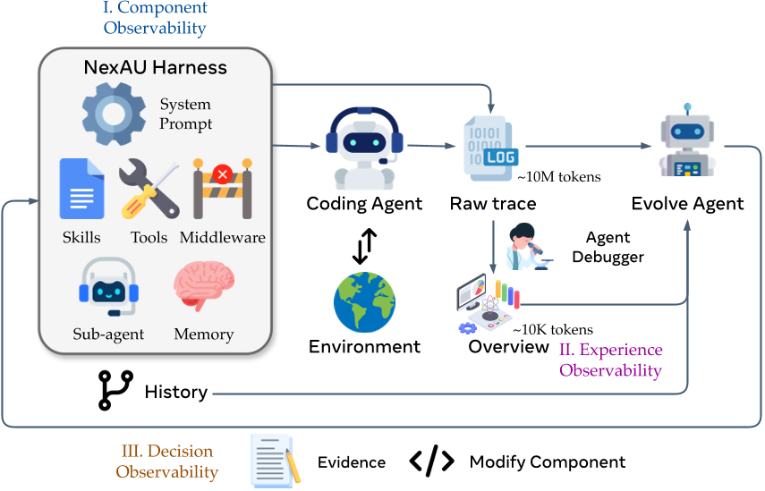
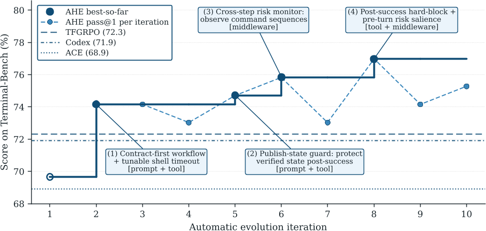
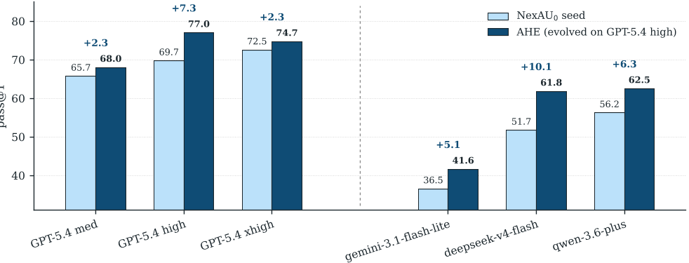
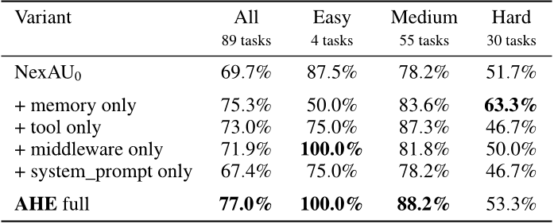
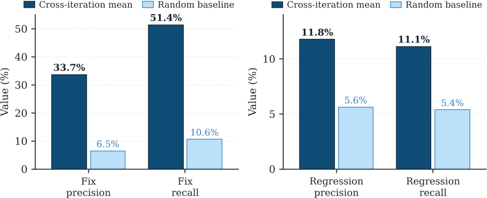

# Daily Paper Reading — Agentic Harness Engineering: Observability-Driven Automatic Evolution of Coding-Agent Harnesses

## Structured Summary

| Dimension | Content |
|---|---|
| **Title** | Agentic Harness Engineering: Observability-Driven Automatic Evolution of Coding-Agent Harnesses |
| **Institution** | Fudan University; Peking University; Shanghai Qiji Zhifeng Co., Ltd |
| **Authors** | Jiahang Lin, Shichun Liu, Chengjun Pan, Lizhi Lin, Shihan Dou, Xuanjing Huang, Hang Yan, Zhenhua Han, Tao Gui |
| **Date** | 2026-04-30 (arXiv v3) |
| **Venue** | arXiv preprint (arXiv:2604.25850v3) |
| **Link** | https://github.com/china-qijizhifeng/agentic-harness-engineering |
| **Summary** | The paper tackles the problem that a coding agent's *harness* — the model-external, editable surface composed of system prompt, tools, middleware, skills, sub-agents, and long-term memory — is still designed by hand and lags behind rapidly evolving base models. It proposes **AHE (Agentic Harness Engineering)**, a closed loop driven by three matched observability pillars (component, experience, decision) that turns every edit into a self-declared, file-level falsifiable contract verified by the next round's task-level deltas. Ten AHE iterations lift pass@1 on Terminal-Bench 2 from 69.7% to 77.0%, beating the human-designed Codex-CLI (71.9%) and the self-evolving baselines ACE and TF-GRPO; the frozen harness transfers to SWE-bench-verified and to four alternate base-model families with +5.1 to +10.1 pp gains and no re-evolution. |

---

## 1. Background and Problem

Coding agents have made measurable progress on long-horizon software-engineering benchmarks, yet their performance is jointly determined by the underlying LLM **and** by the surrounding harness — system prompt, tools, middleware, skills, memory. Today this harness is hand-tuned: developers inspect rollouts, hypothesize fixes, and edit one component at a time, a manual loop that fails to keep up with rapid base-model releases and creates a widening gap between model capability and what the harness can actually realize. The paper argues this gap is the central practical bottleneck for deploying frontier coding agents.

### 1.1 Core Hypothesis

The authors hypothesize that the bottleneck of agent-driven harness evolution is *observability*, not agent capability: once the evolution agent receives a clear action space, a structured experience corpus, and a falsifiable contract for every edit, it can reliably converge to better harness designs. The driving research question is stated explicitly: *"How can an evolution agent **jointly and stably** evolve all editable components of a coding agent's harness?"* (§1).

---

## 2. Method

AHE casts harness optimization as a closed loop driven by another agent, with the base model held fixed and only the explicit harness edited. **Component observability** is realized on top of the NexAU framework, which exposes seven orthogonal component types (system prompt, tool description, tool implementation, middleware, skills, sub-agent configuration, long-term memory) as distinct files at fixed mount points; each failure pattern thereby maps to a single component class, and every logical edit becomes one git commit with file-level diffs and rollback for free. **Experience observability** is realized by Agent Debugger, which routes each rollout message into its own file inside a navigable, shell-scriptable workspace, asks a debugger agent to produce per-task analyses, and aggregates them into a benchmark-level overview — distilling millions of raw trajectory tokens into a layered, drill-down corpus of roughly 10K tokens consumed via *progressive disclosure*. **Decision observability** binds every edit to a *change manifest* containing failure evidence, inferred root cause, targeted fix, and a predicted impact set (expected fixes plus at-risk regressions); the next round intersects these predictions with observed task-level deltas, so each edit becomes a measurable contract that is auto-confirmed or auto-reverted. Algorithm 1 composes the three layers into one iteration: rollout → clean → attribute the prior manifest and roll back rejected edits → distill → workspace edits + new manifest → git-tag commit. Hard governance constraints (the Evolve Agent can write only inside the harness workspace; runs/tracer/verifier/LLM configs are read-only; the seed system prompt is non-deletable) block the obvious self-modification shortcuts.

---

## 3. Experiments

### 3.1 Experimental Setup

| Dimension | Name | Quantity |
|---|---|---|
| **Models** | GPT-5.4 (high / medium / xhigh, shared by Code Agent, Agent Debugger, Evolve Agent); cross-family transfer bases: qwen-3.6-plus, gemini-3.1-flash-lite-preview, deepseek-v4-flash | 1 main base + 5 cross-family configurations |
| **Training (evolution)** | 10 AHE iterations on Terminal-Bench 2, k=2 rollouts per task per iteration, ~32 hours total | 89 tasks (4 easy / 55 medium / 30 hard), 178 rollouts per round |
| **Evaluation** | Terminal-Bench 2 (in-domain); SWE-bench-verified (cross-benchmark transfer, no re-evolution) | 89 tasks + 500 tasks across 7 repos (django, sympy, sphinx-doc, matplotlib, scikit-learn, pydata, astropy) |
| **Metrics** | pass@1 (mean binary success over k rollouts); tokens/trial (mean prompt + completion tokens per trial, in thousands) | 2 |

Baselines include three human-designed harnesses (opencode, terminus-2, Codex-CLI) and two self-evolution loops layered on the same NexAU₀ seed (ACE, TF-GRPO). Infrastructure uses Harbor as dispatcher, fresh per-task E2E remote sandboxes, InMemoryTracer mirrored to Langfuse, and Agent Debugger at concurrency 16 with a 600 s per-task timeout.

### 3.2 Experimental Analysis

#### 3.2.1 Main Result: AHE evolution curve on Terminal-Bench 2

- **Figure content**: The x-axis is the automatic-evolution iteration index (1–10) and the y-axis is pass@1 on Terminal-Bench 2 (%). The solid line is AHE best-so-far, the dashed line is per-iteration pass@1, and three horizontal references mark TF-GRPO (72.3), Codex (71.9), and ACE (68.9). Annotations describe the key edits at each step (contract-first workflow + tunable shell timeout, publish-state guard, cross-step risk monitor, post-success hard-block).
- **Revealed insights**: Per-iteration pass@1 is non-monotone (some rounds regress), but the best-so-far curve climbs monotonically, indicating that the manifest-plus-rollback design absorbs unsuccessful trial-and-error without collapsing the whole run.
- **Key data**: NexAU₀ seed 69.7% → AHE 77.0% (+7.3 pp); +5.1 pp over Codex-CLI, +4.7 pp over TF-GRPO, +8.1 pp over ACE; per-difficulty AHE achieves 100% / 88.2% / 53.3% on Easy/Medium/Hard, trailing only Codex on Hard (56.7%).

#### 3.2.2 Cross-model transfer with the frozen harness

- **Figure content**: Each pair of bars represents a base model — light blue is the NexAU₀ seed pass@1, dark blue is the same harness re-pointed at the base after AHE evolution; absolute deltas are annotated above each pair.
- **Revealed insights**: All five cross-model transfers are positive (+2.3 to +10.1 pp), and the further the base sits from the GPT-5.4 high evolution point, the larger the absolute gain — deepseek-v4-flash +10.1 pp, qwen-3.6-plus +6.3 pp, gemini-3.1-flash-lite +5.1 pp, all above the +2.3 pp on GPT-5.4 medium/xhigh. This is consistent with AHE encoding general engineering coordination patterns inside tools/middleware/memory rather than overfitting to one provider's prompt idioms.

#### 3.2.3 Component-level ablation: where the gain actually lives

- **Figure content**: The table reports pass@1 across All / Easy / Medium / Hard for the NexAU₀ seed, four single-component variants, and full AHE.
- **Revealed insights**: Three of the four single-component swaps already beat the seed (+5.6 memory, +3.3 tool, +2.2 middleware), while "+ system_prompt only" regresses by 2.3 pp — indicating factual harness structure transfers but prose-level strategy does not. Components are non-additive: "+ memory only" reaches **63.3% on Hard**, surpassing full AHE's 53.3%, because memory, middleware, and system prompt all push toward the same closure-style verification and compete for the long-horizon turn budget. The aggregate (driven by 55 Medium tasks) converges to a Medium-heavy trade-off that gives back part of the Hard memory effect.

#### 3.2.4 Self-attribution reliability of the evolve agent

- **Figure content**: The left pair of bars are Fix precision / Fix recall, the right pair are Regression precision / Regression recall; dark bars are cross-iteration means, light bars are the random-prediction baseline.
- **Revealed insights**: Fix-side targeting is genuinely evidence-driven — precision 33.7% (vs. 6.5%) and recall 51.4% (vs. 10.6%) are roughly 5× baseline, so each edit aims at a real, agent-anticipated target. The regression side is the opposite story — precision 11.8% and recall 11.1% sit only ~2× baseline, so most upcoming regressions go unforeseen, which is exactly what produces the non-monotone steps in the evolution curve. The authors flag closing this regression-foresight gap as the clearest direction for future self-evolution loops.

---

## 4. Limitations and Future Work

### 4.1 Original Description

The paper has a dedicated *Limitations* section enumerating three constraints. **Benchmark scope**: evolution is driven only on Terminal-Bench 2 and transfer is probed only on SWE-bench-verified; broader programming languages, repository-scale deployments, and human-in-the-loop workflows remain untested. **Evolution operating point**: AHE's step budget and per-task timeout were fitted to GPT-5.4 high, so cross-model transfer numbers conflate harness portability with operating-point coupling — within one family the +2.3 / +7.3 / +2.3 pp non-monotonicity across reasoning tiers is symptomatic, and disentangling these factors will require re-running the loop under multiple operating points. **Self-modification governance**: AHE bounds edits to a workspace, attributes every change in a versioned manifest, and rolls back ineffective edits at file granularity, but does not provide a complete guardrail stack — long-horizon harness cleanup and stronger misuse prevention remain incomplete, and the authors explicitly position AHE as a controlled research prototype rather than a fully mature autonomous self-improvement system. The analysis sections additionally call out *non-additive component interaction* and *near-random regression self-attribution* (§4.4.1, §4.4.2) as the two architectural constraints worth attacking next.

### 4.2 Model Summary

AHE's most appealing move is treating *observability* as the executable interface for agent self-evolution: by binding every edit to a falsifiable contract and a file-level rollback path, it sidesteps the standard "reward signal drowned by noise" failure mode that plagues most self-improvement loops, and the manifest-first ordering of Algorithm 1 makes the design unusually clean. The high-variance nature of the setup is also visible: 89 evolution tasks with 178 rollouts per round may be too thin to surface long-tail failure modes; memory, middleware, and system-prompt fixes overlap heavily in the closure-style verification regime, hinting that the true dimensionality of the harness design space is lower than the seven-component decomposition; and the near-random regression-attribution result implies the binding constraint at scale will not be "finding good edits" but "foreseeing bad ones." Plausible follow-ups include (1) replacing prose change manifests with executable regression test sets that the verifier can directly consume; (2) co-evolving across reasoning tiers and timeout budgets to decouple harness portability from operating-point fit; (3) introducing component-interaction-aware objectives so Medium-heavy optimization no longer eats Hard memory gains; and (4) using AHE's manifest ledger as supervision for a harness-aware reward model, closing the loop between observability-driven evolution and model-side training. (Generated by Claude Opus 4.7)
