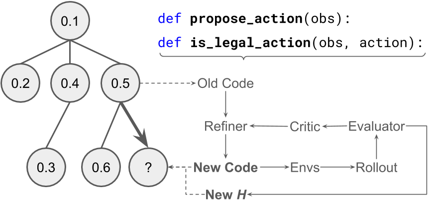
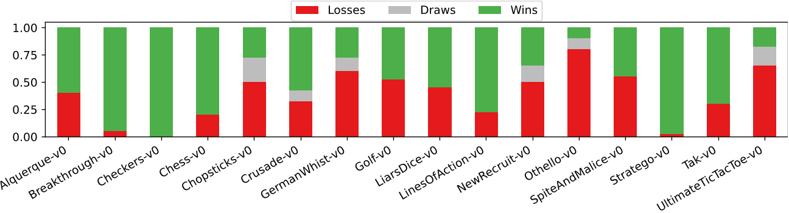
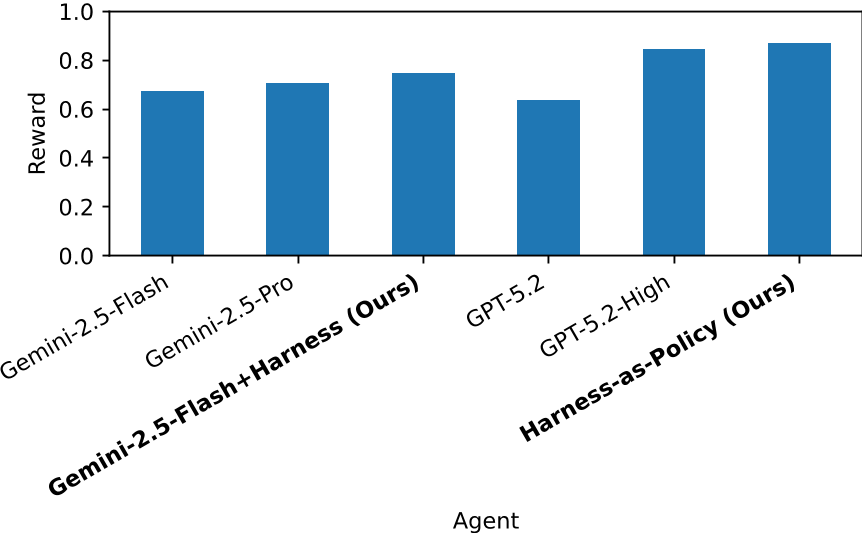
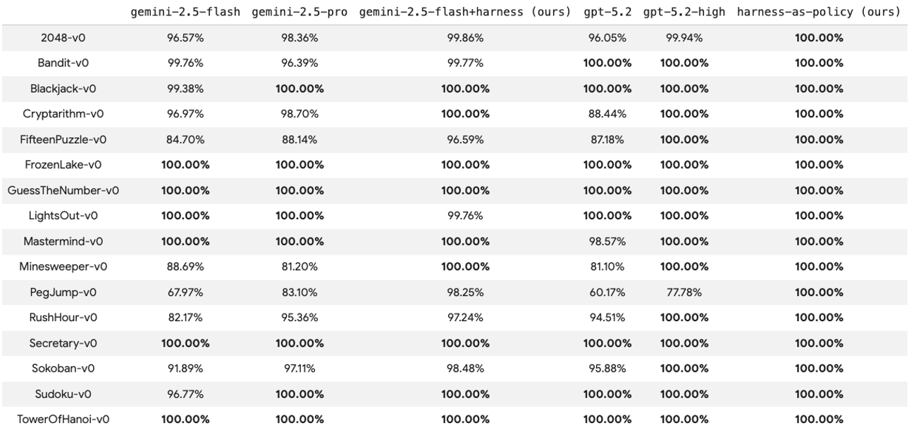

# Daily Paper Reading — AutoHarness: improving LLM agents by automatically synthesizing a code harness

## Structured Summary

| Dimension | Content |
|---|---|
| **Title** | AutoHarness: improving LLM agents by automatically synthesizing a code harness |
| **Institution** | Google DeepMind |
| **Authors** | Xinghua Lou, Miguel Lázaro-Gredilla, Antoine Dedieu, Carter Wendelken, Wolfgang Lehrach, Kevin P. Murphy |
| **Date** | March 5, 2026 |
| **Venue** | arXiv:2603.03329v1 |
| **Link** |  |
| **Summary** | This work addresses the problem of LLM agents frequently executing illegal moves in game environments. The authors propose AutoHarness, which uses Gemini-2.5-Flash to automatically synthesize a code harness via iterative code refinement guided by Thompson sampling-based tree search over the program space. The method achieves 100% legal action rate across 145 TextArena games, enabling the smaller Gemini-2.5-Flash to outperform the larger Gemini-2.5-Pro; when pushed to generate entire policies as code (harness-as-policy), it achieves higher average reward than both Gemini-2.5-Pro and GPT-5.2-High on 16 single-player games. |

---

## 1. Background and Problem

This research falls within the domain of LLM agents for planning and decision-making in game environments. Despite significant advances in code synthesis and mathematical reasoning, LLMs used as agents frequently attempt actions that are strictly prohibited by the environment — for example, in the Kaggle GameArena chess competition, 78% of Gemini-2.5-Flash losses were attributed to illegal moves rather than strategic errors. Traditional mitigations involve fine-tuning on game trajectories or hand-coding harnesses to verify move validity, but these approaches are neither scalable nor cost-effective. The core question this paper addresses is: can an LLM automatically synthesize its own code harness to eliminate illegal actions without human intervention?

### 1.1 Core Hypothesis

The paper proposes two levels of hypothesis: (1) an LLM can automatically generate a legal action verifier (`is_legal_action()`) through iterative code refinement, achieving 100% legal action rate across diverse games; (2) more ambitiously, an LLM can encode the entire decision policy as pure code (`propose_action()`), eliminating the need for LLM calls at inference time while achieving superior game performance.

---

## 2. Method

AutoHarness formulates harness generation as a search problem over program space, employing Thompson sampling-guided tree search (Tang et al., 2024) to efficiently explore candidate code. In the tree structure, each node represents a code version whose heuristic value is its legal action success rate in the environment. The search is driven by three core components: the **Evaluator** runs rollouts of up to 1000 steps across 10 parallel environments to detect illegal moves and code execution errors; the **Critic** consolidates up to 5 failed steps with error messages into structured feedback; and the **Refiner** acts as a mutation operator, generating new candidate code given the old code and error feedback. The method supports two harness modes: **harness-as-action-filter** learns only `is_legal_action()` to filter LLM-proposed actions (forming a rejection sampler), and **harness-as-policy** learns both `propose_action()` and `is_legal_action()`, encoding the entire policy as pure Python code that requires no LLM calls at inference time. Training uses Gemini-2.5-Flash and terminates when the heuristic reaches 1.0 or times out.

---

## 3. Experiments

### 3.1 Experimental Setup

| Dimension | Name | Quantity |
|---|---|---|
| **Models** | Gemini-2.5-Flash, Gemini-2.5-Pro, GPT-5.2, GPT-5.2-High, Gemini-2.5-Flash+Harness (ours), Harness-as-Policy (ours) | 6 |
| **Training** | TextArena game environments (feedback via rollouts) | 145 games |
| **Evaluation** | TextArena 1P games (16) + 2P games (16) | 32 |
| **Metrics** | Legal Action Rate, Average Reward (1P), Win/Draw/Loss Rate (2P) | 3 |

### 3.2 Experimental Analysis

### 3.2.1 Two-Player Game Results (Figure 3)

- **Figure Content**: This figure shows the win/lose/draw rates of Gemini-2.5-Flash+Harness against Gemini-2.5-Pro across 16 two-player games, with game names on the x-axis and rate proportions on the y-axis.
- **Revealed Insights**: AutoHarness enables the smaller Gemini-2.5-Flash to win 9 out of 16 games against the much larger Gemini-2.5-Pro, achieving an overall win rate of 56.3% versus Pro's 38.2%. When playing against vanilla Gemini-2.5-Flash, the win rate rises to 64.8%.
- **Key Data**: The method shows particularly strong performance in complex strategy games such as Chess, Othello, and Stratego, with near-zero loss rates.

### 3.2.2 Single-Player Multi-Agent Comparison (Figure 5)

- **Figure Content**: This figure compares the average reward of six agents across 16 single-player games: Gemini-2.5-Flash (0.673), Gemini-2.5-Pro (0.707), Gemini-2.5-Flash+Harness (0.745), GPT-5.2 (0.635), GPT-5.2-High (0.844), and Harness-as-Policy (0.870).
- **Revealed Insights**: Harness-as-Policy achieves the highest average reward of 0.870, outperforming GPT-5.2-High (0.844) and Gemini-2.5-Pro (0.707). This demonstrates that encoding the entire policy as code not only eliminates LLM inference costs but also yields superior performance.
- **Key Data**: On a per-game basis, Harness-as-Policy wins 3/16 games, GPT-5.2-High wins 5/16, and the remaining 8/16 are ties. Since Harness-as-Policy generates pure Python code, its inference cost is near zero, while the GPT-5.2 experiments cost approximately $640.

### 3.2.3 Legal Action Rate Analysis (Figure 7)

- **Figure Content**: This table presents the per-game legal action success rate for each agent across 16 single-player games, comparing Gemini-2.5-Flash, Gemini-2.5-Pro, AutoHarness, GPT-5.2, GPT-5.2-High, and Harness-as-Policy.
- **Revealed Insights**: Both AutoHarness and Harness-as-Policy achieve a perfect 100% legal action rate across all 16 games, while all other models exhibit significant illegal action issues on multiple games.
- **Key Data**: Gemini-2.5-Flash achieves only 67.97% on PegJump-v0, GPT-5.2 only 60.17% on PegJump-v0, and Gemini-2.5-Pro only 88.14% on FifteenPuzzle-v0, highlighting systematic failures of LLMs in understanding complex game rules.

---

## 4. Limitations and Future Work

### 4.1 Original Description

The authors note that the current approach generates a separate harness for each game environment without cross-game knowledge transfer. Future directions include: (1) distilling domain-specific expert knowledge back into the base LLM for recursive self-improvement; (2) building a library of reusable harnesses; and (3) extending the method to more challenging multimodal game environments such as Craftax and Terra Nova. Additionally, harness-as-policy is currently limited to single-player games, as two-player games require strategic reasoning about the opponent's policy, often necessitating MCTS-like methods.

### 4.2 Model Summary

The core contribution of this work lies in demonstrating the effectiveness of the "constraining LLMs with code" paradigm, but several limitations remain. The method relies on the environment providing clear legal/illegal feedback signals, which may not directly transfer to real-world tasks with ambiguous feedback. While Thompson sampling tree search is effective, some games (e.g., Breakthrough-v0-small) require 136 iterations to converge, suggesting room for training efficiency improvements. Furthermore, while the pure code policies generated by harness-as-policy perform well on rule-based games, their ceiling may be limited for complex strategic scenarios requiring deep reasoning. Promising future directions include combining this approach with reinforcement learning or search algorithms, exploring meta-learning strategies across games, and extending the code-as-harness paradigm to non-game domains such as robotics control and dialogue systems. (Generated by Claude Opus 4.6 model)
