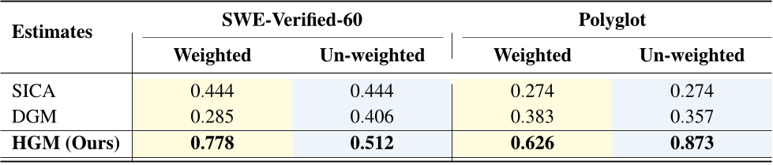
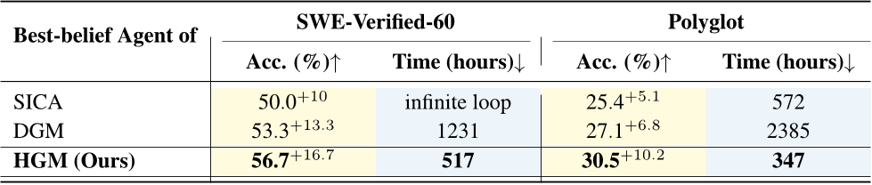
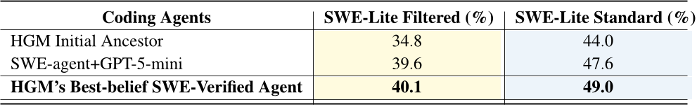
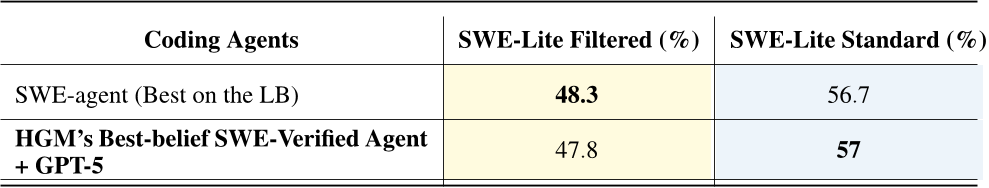

# Daily Paper Reading — Huxley-Gödel Machine: Human-Level Coding Agent Development by an Approximation of the Optimal Self-Improving Machine

## Structured Summary

| Dimension | Content |
|---|---|
| **Title** | Huxley-Gödel Machine: Human-Level Coding Agent Development by an Approximation of the Optimal Self-Improving Machine |
| **Institution** | King Abdullah University of Science and Technology (KAUST) |
| **Authors** | Wenyi Wang*, Piotr Piękos*, Li Nanbo, Firas Laakom, Yimeng Chen, Mateusz Ostaszewski, Mingchen Zhuge, Jürgen Schmidhuber (*equal contribution) |
| **Date** | October 29, 2025 (arXiv:2510.21614v3) |
| **Venue** | arXiv preprint |
| **Link** | https://github.com/metauto-ai/HGM |
| **Summary** | This work addresses the Metaproductivity-Performance Mismatch in self-improving coding agent search: benchmark performance does not reliably predict an agent's potential for further self-improvement. The authors propose Clade-Metaproductivity (CMP), prove that under certain assumptions a CMP oracle suffices to implement the Gödel Machine's acceptance mechanism, and design the Huxley-Gödel Machine (HGM), which estimates CMP from clade-aggregated descendant outcomes and guides tree expansion via Thompson sampling. HGM outperforms DGM and SICA on SWE-bench Verified and Polyglot with fewer CPU-hours, and its discovered agent, paired with GPT-5, matches the best officially checked human-engineered coding agents on SWE-bench Lite. |

---

## 1. Background and Problem

This research sits at the intersection of self-referential / self-improving AI and LLM-based coding agents: recent systems (DGM, SICA) let coding agents iteratively edit their own codebases and use software engineering benchmark scores to decide which agent node to expand. However, the authors observe that "a high-scoring agent may produce unproductive descendants, while a lower-scoring one seeds lineages that achieve greater long-term gains," a phenomenon they term the Metaproductivity-Performance Mismatch (MPM). The core problem this paper tackles is how to design a search criterion that reliably measures and exploits an agent's long-term self-improvement potential, so that a practical algorithm approximates the theoretically optimal Gödel Machine.

### 1.1 Core Hypothesis

The core hypothesis is that aggregating the benchmark performance of all descendants of an agent (its clade) predicts self-improvement potential better than the agent's own immediate benchmark score. Theoretically, under Assumption 1 (the objective depends only on the final agent's utility, evaluations are repeatable trials, proofs cost no budget, and each self-modification costs exactly one budget unit), the authors prove Theorem 1: "access to the CMP oracle is sufficient to implement the Gödel Machine."

---

## 2. Method

HGM formalizes self-improvement as an iterative tree search: starting from an initial agent, each step either expands a node (the selected agent self-modifies to produce a child) or evaluates a node (the agent is assigned one more benchmark task). Its core is the CMP estimator, which aggregates the success/failure test counts of all agents in a node's clade as nC_success / (nC_success + nC_failure), replacing single-node benchmark scores with clade-wide evidence — better aligned with the true objective of self-improvement and statistically more robust thanks to more samples. Both the expansion and evaluation policies use Thompson Sampling over Beta posteriors, with a monotonically increasing exploration-exploitation scheduler τ = B/b (B total budget, b remaining budget) that encourages exploration early and polarizes the sampling distribution near the end; the choice between expansion and evaluation follows the UCB-Air strategy from the infinite-armed bandit literature, expanding a new agent only when the number of evaluations satisfies N^α ≥ |T| (α = 0.6). Unlike the rigid DGM/SICA loop where every newly created agent is immediately evaluated on many tasks, HGM decouples expansion from evaluation at the granularity of single agent–task pairs, enabling early stopping on unpromising agents and naturally supporting an asynchronous parallel implementation (HGM Async) that keeps all available CPUs busy. When the budget is exhausted, HGM returns the "best-belief agent" — the agent with the highest ϵ-percentile of the utility posterior in the final tree.

---

## 3. Experiments

### 3.1 Experimental Setup

| Dimension | Name | Quantity |
|---|---|---|
| **Models** | GPT-5 (expansion on SWE-Verified / transfer evaluation), GPT-5-mini (evaluation on SWE-Verified), Qwen3-Coder-480B-A35B-Instruct (expansion on Polyglot, AutoRound int4/int8 mixed quantization), Qwen3-Coder-30B-A3B-Instruct (evaluation on Polyglot) | 4 |
| **Training** | No training set (self-improvement search, no parameter training); search budget of 800 evaluations (comparison experiments) or 8000 evaluations (full SWE-Verified) | — |
| **Evaluation** | SWE-bench Verified (500 tasks), SWE-Verified-60 (60-task subset), SWE-bench Lite (300 tasks, 93 overlapping with Verified), Polyglot | 4 benchmarks |
| **Metrics** | Accuracy (task success rate), Allocated CPU-Hours, Pearson correlation (weighted/unweighted) | 3 |

The total experimental cost was approximately $5000 USD across all three methods; HGM hyperparameters are τ = B/b, ϵ = 1, α = 0.6, all runs use HGM-Async, and the initial agent is adopted from DGM's official implementation.

### 3.2 Experimental Analysis

### 3.2.1 Metaproductivity-Performance Mismatch and CMP Estimation Reliability

- **Figure/Table Content**: The table reports Pearson correlations (weighted and unweighted) between each method's selection criterion and the empirical CMP computed per node after each run, on SWE-Verified-60 and Polyglot.
- **Revealed Insights**: The performance-based estimates of SICA and DGM correlate only weakly (0.27–0.44) with true self-improvement potential, confirming that MPM occurs in practice; HGM's clade-level estimator is substantially more reliable.
- **Key Data**: HGM achieves weighted correlations of 0.778 (SWE-Verified-60) and 0.626 (Polyglot), and an unweighted correlation of 0.873 on Polyglot, far surpassing SICA (0.444/0.274) and DGM (0.285/0.383).

### 3.2.2 Self-Improving Capability Comparison

- **Figure/Table Content**: The table compares SICA, DGM, and HGM under the same initial agent (40% on SWE-Verified-60, 20.3% on Polyglot) and an 800-evaluation budget, reporting the final agent's accuracy and consumed CPU-hours.
- **Revealed Insights**: HGM simultaneously attains the highest accuracy and lowest compute cost on both benchmarks, validating the dual benefit of CMP guidance plus asynchronous decoupling; SICA fell into repeated errors after consuming 45% of its budget on SWE-Verified-60 and could not continue self-modifying.
- **Key Data**: HGM reaches 56.7% (+16.7) / 517 hours on SWE-Verified-60 and 30.5% (+10.2) / 347 hours on Polyglot, running 2.38× and 6.86× faster than DGM, respectively.

### 3.2.3 HGM vs. Humans: SWE-Lite Generalization and Cross-Model Transfer

- **Figure/Table Content**: Table 3 reports the SWE-Lite accuracy of the agent discovered on full SWE-Verified (8000 evaluations, optimized to 61.4%) under a filtered setting (93 overlapping tasks excluded) and the standard leaderboard setting; Table 4 compares the same agent against the first-place SWE-agent after replacing its GPT-5-mini backbone with GPT-5.
- **Revealed Insights**: The HGM-evolved agent outperforms both its initial ancestor and SWE-agent with the same backbone on completely unseen tasks, indicating that the gains stem from genuine agent design improvements rather than overfitting to the optimization set or a particular LLM; performance is preserved under a stronger backbone, showing the evolved design principles transfer across model scales.
- **Key Data**: With GPT-5-mini, the HGM agent scores 40.1% (filtered) / 49.0% (standard) versus 39.6% / 47.6% for SWE-agent + GPT-5-mini; with GPT-5, it reaches 57% in the standard setting, slightly above the officially checked leaderboard leader SWE-agent (56.7%), i.e., human-level coding agent design.

---

## 4. Limitations and Future Work

### 4.1 Original Description

The paper has no dedicated limitations section, but it explicitly notes two caveats. First, "higher scores on the leaderboard do not necessarily indicate superior general coding ability—since both human- and machine-designed agents may overfit to the benchmark." Second, the theoretical result depends on the restrictive conditions of Assumption 1 (the objective depends only on the final agent's utility, evaluations are repeatable trials, proofs consume no budget, and each self-modification costs exactly one budget unit), which differ from the original Gödel Machine's single-life, time-aware setting. Appendix B also notes that the asynchronous implementation introduces a bias favoring agents with fewer evaluated results, mitigated by initializing with 5 parallel expansions of the initial agent.

### 4.2 Model Summary

The main limitations are that CMP estimation requires sufficiently many descendant evaluations — early in the search, when the tree is small and clades are shallow, it differs little from single-node performance estimates — and that the theoretical guarantee rests on a static-benchmark assumption (repeatable trials, fixed utility), which does not directly extend to open-ended settings where the environment changes over time or reward signals are sparse; moreover, the experiments cover only software engineering benchmarks and two model families, and the ~$5000 search cost limits larger-scale validation. Promising future directions include extending the CMP idea to agent self-improvement beyond coding (e.g., research agents, robot policy iteration), developing theory that relaxes Assumption 1 for non-stationary environments, combining learned priors (e.g., LLM-predicted self-modification quality) to accelerate the cold start of CMP estimation, and analyzing the interpretability and safety of self-modification lineages to prevent agents from evolving shortcut behaviors that game the evaluation. (Generated by Claude Fable 5)
