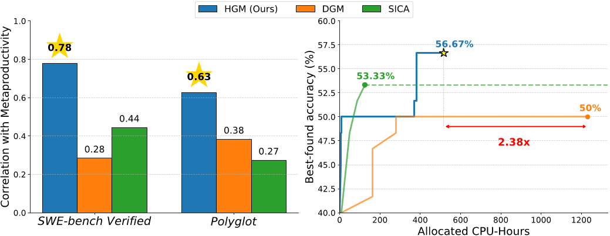

# 每日论文报告 — Huxley-Gödel Machine: Human-Level Coding Agent Development by an Approximation of the Optimal Self-Improving Machine

## 结构化摘要

| 维度 | 内容 |
|---|---|
| **标题** | Huxley-Gödel Machine: Human-Level Coding Agent Development by an Approximation of the Optimal Self-Improving Machine |
| **机构** | 沙特阿卜杜拉国王科技大学（KAUST） |
| **作者** | Wenyi Wang*, Piotr Piękos*, Li Nanbo, Firas Laakom, Yimeng Chen, Mateusz Ostaszewski, Mingchen Zhuge, Jürgen Schmidhuber（*为共同一作） |
| **时间** | 2025年10月29日（arXiv:2510.21614v3） |
| **发表** | arXiv 预印本 |
| **链接** | https://github.com/metauto-ai/HGM |
| **总结** | 该研究旨在解决自我改进编码智能体（self-improving coding agent）搜索中"基准性能并不能可靠预测自我改进潜力"的元生产力–性能错配（Metaproductivity-Performance Mismatch）问题。作者提出谱系级元生产力（Clade-Metaproductivity, CMP）指标，证明在特定假设下 CMP 神谕（oracle）足以复现哥德尔机（Gödel Machine）的最优自我修改决策，并据此设计了用 Thompson 采样估计 CMP 来引导自我修改树搜索的 Huxley-Gödel Machine（HGM）。实验表明 HGM 在 SWE-bench Verified 和 Polyglot 上以更少的 CPU 时间超越 DGM 和 SICA；其发现的智能体在 SWE-bench Lite 上配合 GPT-5 达到与最佳人工设计编码智能体持平的人类水平表现。 |

---

## 1. 研究背景和问题

本研究属于自我改进人工智能（self-referential / self-improving AI）与 LLM 编码智能体的交叉领域：近期工作（DGM、SICA）让编码智能体迭代修改自身代码库，并用软件工程基准分数来决定扩展哪个智能体节点。然而作者发现"高分智能体可能产生无成效的后代，而低分智能体却可能孕育出获得更大长期收益的谱系"（原文："a high-scoring agent may produce unproductive descendants, while a lower-scoring one seeds lineages that achieve greater long-term gains"），即元生产力–性能错配（Metaproductivity-Performance Mismatch, MPM）。本文要解决的核心问题是：如何设计一个能可靠衡量并利用智能体长期自我改进潜力的搜索准则，使实践算法逼近理论最优的哥德尔机。

### 1.1 核心假设

本文的核心假设是：聚合一个智能体全部后代（即其谱系，clade）的基准表现，比该智能体自身的即时基准表现更能预测其自我改进潜力。理论上，作者在假设 1（Assumption 1，包括目标仅为最终智能体的效用、评测可重复、每次自我修改消耗一单位预算等）下证明了定理 1："拥有 CMP 神谕足以实现哥德尔机"（原文："access to the CMP oracle is sufficient to implement the Gödel Machine"）。

---

## 2. 方法

HGM 将自我改进形式化为迭代树搜索：从初始智能体出发，每一步要么"扩展"（让某节点自我修改产生子节点），要么"评估"（给某节点分配一个基准任务）。其核心是 CMP 估计器——将一个节点的谱系内所有后代的成功/失败测试数聚合为 nC_success / (nC_success + nC_failure)，从而用整个谱系的证据替代单点基准分数，既对齐"自我改进能力"这一真正目标，又因样本更多而统计上更稳健。扩展策略与评估策略均采用 Thompson 采样（Thompson Sampling）从 Beta 后验中抽样选点，并引入随时间单调递增的探索–利用调度器 τ = B/b（B 为总预算、b 为剩余预算），前期鼓励探索、后期收敛于最优节点；扩展与评估的取舍借鉴无穷臂老虎机（infinite-armed bandit）的 UCB-Air 策略，当评估次数 N^α ≥ |T|（α=0.6）时才扩展新智能体。与 DGM/SICA"每生成一个新智能体就立即在大量任务上评估"的僵化流程不同，HGM 将扩展与评估解耦为单个智能体–任务对粒度，可对无前途的智能体提前止损，并由此自然支持异步并行实现（HGM Async），充分利用所有可用 CPU。预算耗尽后，返回效用后验 ϵ 分位数最高的"最佳信念智能体"（best-belief agent）。

---

## 3. 实验

### 3.1 实验设置

| 维度 | 名称 | 数量 |
|---|---|---|
| **模型** | GPT-5（SWE-Verified 扩展 / 迁移评测）、GPT-5-mini（SWE-Verified 评估）、Qwen3-Coder-480B-A35B-Instruct（Polyglot 扩展，AutoRound int4/int8 混合量化）、Qwen3-Coder-30B-A3B-Instruct（Polyglot 评估） | 4 |
| **训练** | 无训练集（自我改进搜索，非参数训练）；搜索预算为 800 次评估（对比实验）或 8000 次评估（全量 SWE-Verified） | — |
| **评测** | SWE-bench Verified（500 题）、SWE-Verified-60（60 题子集）、SWE-bench Lite（300 题，其中 93 题与 Verified 重叠）、Polyglot | 4 个基准 |
| **指标** | 准确率（任务解决率，Accuracy）、分配 CPU 小时数（Allocated CPU-Hours）、Pearson 相关系数（加权/非加权） | 3 |

实验总花费约 5000 美元（含全部三种方法）；HGM 超参数为 τ = B/b、ϵ = 1、α = 0.6，全部实验使用 HGM-Async，初始智能体沿用 DGM 官方实现。

### 3.2 实验解析

### 3.2.1 元生产力–性能错配与 CMP 估计可靠性（Metaproductivity-Performance Mismatch）

- **图表内容**：该表报告三种方法的选择准则与运行结束后逐节点计算的经验 CMP 之间的 Pearson 相关系数（加权/非加权），数据集为 SWE-Verified-60 与 Polyglot。
- **揭示关系**：SICA 与 DGM 基于基准性能的估计与真实自我改进潜力仅有弱相关（0.27–0.44），证实 MPM 现象确实存在；HGM 的谱系级估计显著更可靠。
- **关键数据**：HGM 加权相关达 0.778（SWE-Verified-60）和 0.626（Polyglot），非加权相关在 Polyglot 上高达 0.873，大幅领先 SICA（0.444/0.274）与 DGM（0.285/0.383）。

### 3.2.2 自我改进能力对比（Self-Improving Capability Comparison）

- **图表内容**：该表对比 SICA、DGM、HGM 在相同初始智能体（SWE-Verified-60 上 40%、Polyglot 上 20.3%）和 800 次评估预算下，最终智能体的准确率与消耗的 CPU 小时。
- **揭示关系**：HGM 在两个基准上同时取得最高准确率和最低计算成本，验证了 CMP 引导加异步解耦带来的双重优势；SICA 在 SWE-Verified-60 上消耗 45% 预算后陷入反复报错而无法继续自我修改。
- **关键数据**：HGM 达 56.7%（+16.7）/ 517 小时（SWE-Verified-60）和 30.5%（+10.2）/ 347 小时（Polyglot），分别比 DGM 快 2.38 倍和 6.86 倍。

### 3.2.3 与人类设计智能体对比：SWE-Lite 泛化与跨模型迁移（HGM vs. Humans）

- **图表内容**：表 3 报告 HGM 在全量 SWE-Verified（8000 次评估，优化后达 61.4%）发现的智能体在 SWE-Lite 上的准确率，分"过滤"（剔除 93 道重叠题）与"标准"（官方排行榜设置）两种设定；表 4 将其骨干从 GPT-5-mini 换成 GPT-5 后与排行榜第一的 SWE-agent 对比。
- **揭示关系**：HGM 进化出的智能体在完全未见任务上仍超越初始祖先和同骨干的 SWE-agent，说明改进源于真实的智能体设计提升而非对优化集或特定 LLM 的过拟合；换用更强骨干后性能依然保持，设计原则可跨模型规模迁移。
- **关键数据**：GPT-5-mini 设定下 HGM 智能体取得 40.1%（过滤）/ 49.0%（标准），优于 SWE-agent + GPT-5-mini 的 39.6% / 47.6%；换 GPT-5 后标准设定达 57%，略超官方核验排行榜第一的 SWE-agent（56.7%），达到人类设计水平。

---

## 4. 局限性与未来工作

### 4.1 原文描述

论文未设独立的局限性章节，但在正文中明确指出两点：其一，"排行榜上更高的分数并不必然意味着更强的通用编码能力——因为无论人工还是机器设计的智能体都可能对基准过拟合"（原文："higher scores on the leaderboard do not necessarily indicate superior general coding ability—since both human- and machine-designed agents may overfit to the benchmark"）；其二，理论结果依赖假设 1 的限定条件（目标仅为最终智能体效用、评测可重复、证明不消耗预算、每次自我修改恰好消耗一单位预算），与原始哥德尔机的单生命、时间敏感设定不同。附录 B 还指出异步实现会引入偏向评估次数少的智能体的偏差，需通过并行初始化 5 次扩展等手段缓解。

### 4.2 模型总结

本研究的主要局限在于：CMP 估计依赖足够多的后代评估样本，在搜索早期（树很小、谱系很浅）时与单点性能估计差异有限，且理论保证建立在"评测可重复、效用固定"的静态基准假设上，难以直接推广到环境随时间变化或奖励信号稀疏的开放场景；此外实验仅覆盖软件工程类基准和两个模型家族，约 5000 美元的搜索成本也限制了更大规模的验证。未来方向包括：将 CMP 思想推广到非编码领域的智能体自我改进（如科研智能体、机器人策略迭代）；研究在非平稳环境下放宽假设 1 的理论框架；结合学习型先验（如用 LLM 预测自我修改质量）来加速 CMP 估计的冷启动；以及分析自我修改谱系的可解释性与安全性，防止智能体进化出规避评测的捷径行为。（由 Claude Fable 5 模型生成）
