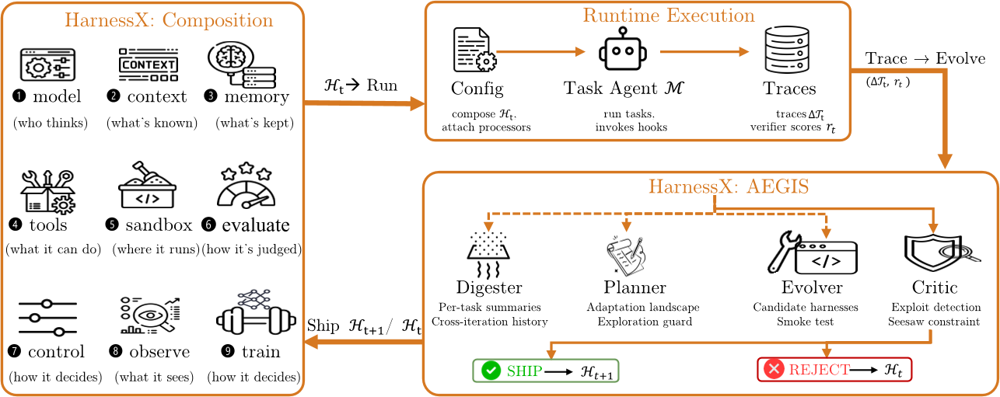
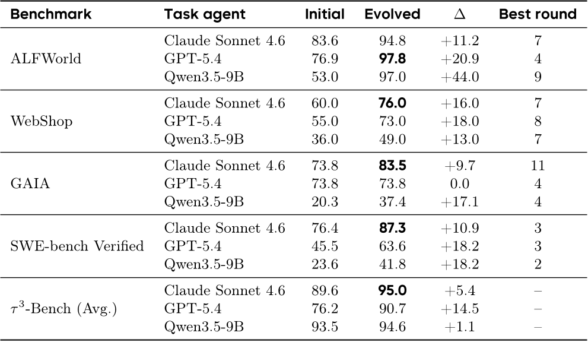
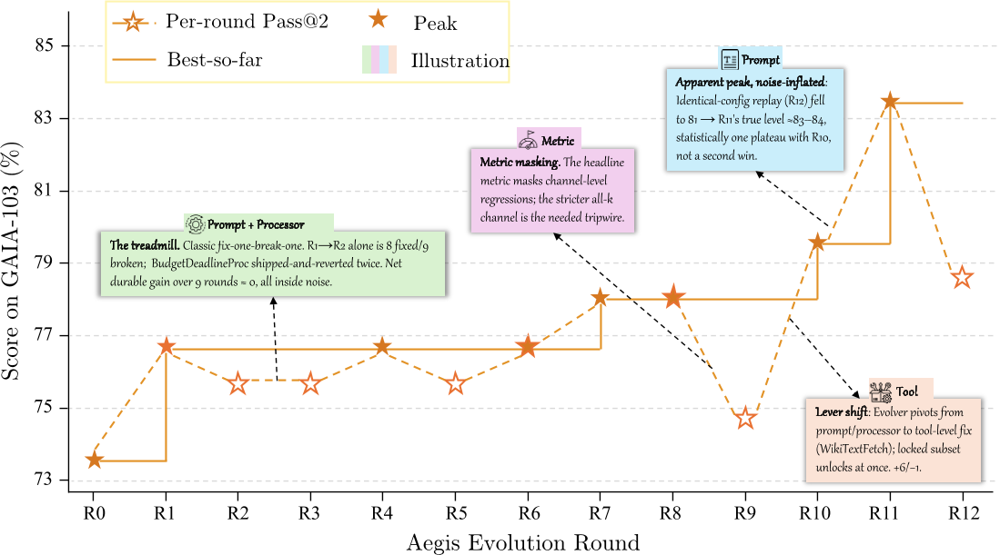
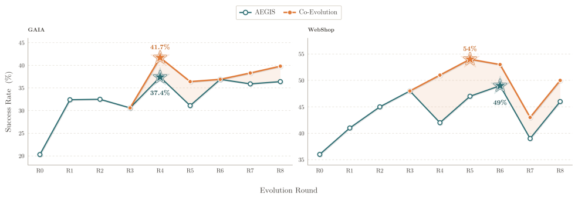

# Daily Paper Reading — HarnessX: A Composable, Adaptive, and Evolvable Agent Harness Foundry

## Structured Summary

| Dimension | Content |
|---|---|
| **Title** | HarnessX: A Composable, Adaptive, and Evolvable Agent Harness Foundry |
| **Institution** | Darwin Agent Team |
| **Authors** | Tingyang Chen*, Shuo Lu*, Kang Zhao*, Weicheng Meng, Kun Shao†, Jian Luan†, Hanlin Teng, Tianhao Li, Chao Li, Xule Liu, Jian Liang, Zhizhong Zhang, Yuan Xie, Heng Qu |
| **Date** | July 2025 |
| **Venue** | ArXiv (2606.14249v2) |
| **Link** | Codebase to be open-sourced in a future release |
| **Summary** | This research addresses the problem that AI agent runtime harnesses—comprising prompts, tools, memory, and control flow—remain hand-crafted and static. HarnessX treats the harness as a composable first-class object, adapts it through AEGIS (a trace-driven multi-agent evolution engine grounded in an operational mirror between symbolic adaptation and RL), and closes the harness-model loop via cross-harness GRPO training. Across five benchmarks, HarnessX achieves an average gain of +14.5% (up to +44.0%), with gains largest for weaker models, demonstrating that composing and evolving runtime interfaces from execution feedback is an actionable lever complementary to model scaling. |

---

## 1. Background and Problem

AI agent performance depends critically on the runtime harness that mediates between the model and its environment, yet current harness development faces three structural gaps. Harnesses are hand-engineered and static, requiring bespoke modification for each new model or task. They are architecturally entangled, mixing prompts, tools, retry policies, and memory in the same codepaths so that changes to one component silently break others. And harness engineering operates independently from model training, discarding the rich execution traces that could drive systematic improvement. This paper addresses the core question of whether the harness can be elevated to a composable, evolvable first-class object that improves continuously from execution feedback and forms a closed optimization loop with model training.

---

## 2. Method

HarnessX is organized into three layers. The **Harness Composition** layer formalizes the harness as a first-class object H = (M, C), where M is a model configuration and C is a harness configuration. C decomposes into a hook-indexed processor list P and shared slot resources S. Every per-step behavior is implemented as a typed Processor attached to one of eight lifecycle hooks, following the protocol `async def process(event) -> AsyncIterator[Event]`. A nine-dimensional taxonomy (model selection, context assembly, memory management, tool ecosystem, execution environment, evaluation/reward, control/safety, observability, training bridge) spans the full behavioral space, and a substitution algebra guarantees type-safe composition and replacement. The **Harness Adaptation** layer introduces AEGIS, whose key insight is mapping harness evolution onto a symbolic-space MDP—harness configurations as states, typed edits as actions, execution traces plus verifier scores as feedback. This mapping predicts three RL pathology analogues (reward hacking, catastrophic forgetting, under-exploration), each addressed by dedicated defenses: the Critic detects reward hacking, the deterministic seesaw constraint prevents catastrophic forgetting, and the Planner counters under-exploration by constructing an adaptation landscape before edit generation. The four-stage pipeline (Digester compresses ~10M trace tokens into ~10K structured summaries → Planner constructs adaptation landscape → Evolver generates typed candidate edits with change manifests → Critic assesses + deterministic gate accepts/rejects) enforces the design principle that "LLM subagents explore and propose; typed structure and deterministic gates determine what ships." The **Harness-Model Co-Evolution** layer breaks two ceilings: the scaffolding ceiling of harness-only evolution and the training-signal ceiling of model-only RL. Through a shared FIFO replay buffer, the same batch of trajectories drives both the AEGIS harness update and Cross-Harness GRPO model training—trajectories of the same task across harness versions are grouped, group-relative advantages are computed, and a clipped policy-gradient step updates the model. The evolving harness acts as a structured exploration operator for the model's RL, injecting diverse behavioral modes that single-policy sampling cannot provide.

---

## 3. Experiments

### 3.1 Experimental Setup

| Dimension | Name | Quantity |
|---|---|---|
| **Models** | Meta-agent: Claude Opus 4.6; Task agents: Claude Sonnet 4.6, GPT-5.4, Qwen3.5-9B | 4 |
| **Training** | Co-evolution uses trajectories from GAIA (103 tasks) and WebShop (100 tasks) as GRPO training data; 8×H100 GPUs, batch size 256, lr 1e-6 | N/A |
| **Evaluation** | GAIA (103), ALFWorld (134), WebShop (100), τ3-Bench (3 domains), SWE-bench Verified (55) | 5 benchmarks, 392+ tasks |
| **Metrics** | Pass@2 success rate (%), with benchmark-specific verifiers (exact match / goal completion / attribute match / rule compliance / patch resolution) | 1 |

### 3.2 Experimental Analysis

### 3.2.1 Main Results

- **Figure/Table Content**: Table 4 and Figure 4 report pass@2 success rates before and after harness evolution across 15 model-benchmark configurations. The x-axis shows evolution rounds and the y-axis shows task success rate.
- **Revealed Insights**: AEGIS improves 14 of 15 configurations, with an average absolute gain of +14.5% (up to +44.0%). A strong inverse-scaling effect is observed: weaker task agents benefit most (e.g., Qwen3.5-9B gains +44.0% on ALFWorld from a 53.0% baseline to 97.0%), while stronger models gain less (Sonnet 4.6: +11.2% on the same benchmark), suggesting that evolved harnesses address behavioral gaps that weaker models cannot self-correct.
- **Key Data**: ALFWorld shows the largest gains (+11.2% to +44.0%); SWE-bench Verified yields +10.9% to +18.2% across all three models; the sole stagnating configuration (GAIA, GPT-5.4, Δ=0.0) results from conflicting edits on heterogeneous tasks and is resolved by variant isolation (Ensemble routing), which lifts accuracy to 87.4% with non-degrading trajectory (peak = final).

### 3.2.2 Co-Evolution Experiment

- **Figure/Table Content**: Figure 5 compares co-evolution (interleaving harness evolution with cross-harness GRPO model training) against harness-only evolution (model frozen) on GAIA and WebShop using Qwen3.5-9B as the task agent.
- **Revealed Insights**: The two curves coincide until joint training takes effect at R4, then diverge with co-evolution consistently at or above harness-only for the remainder. Co-evolution breaks the scaffolding ceiling where harness-only evolution plateaus (~37% on GAIA, ~49% on WebShop), yielding additional +4.3% on GAIA (37.4% → 41.7%) and +5.0% on WebShop (49.0% → 54.0%), averaging +4.7%. This confirms the complementarity of structural harness evolution and parametric model optimization—the evolving harness provides new behavioral modes as a structured exploration operator, while cross-harness GRPO internalizes the most successful strategies into model parameters.

---

## 4. Limitations and Future Work

### 4.1 Original Description

The paper explicitly identifies five limitations: (1) **No held-out evaluation**—all gains are measured on the same task set used for evolution, carrying selection bias and potential overfitting; generalization to unseen tasks is plausible but untested. (2) **Discrete action spaces only**—all experiments use text-based interactions; extension to continuous action spaces (e.g., robotic control) is untested. (3) **Closed-source meta-agent**—AEGIS requires a meta-agent capable of multi-file code generation and structured trace analysis; open-weight alternatives remain untested. (4) **Joint control assumption**—co-evolution requires simultaneous control over harness evolution and model training, which in practice are often separated across teams. (5) **Benchmark coverage**—SWE-bench uses only a 55-task subsample and τ3-Bench covers only three domains. Additionally, the τ3-Bench Telecom failure case reveals a structural limitation of per-edit gating: sub-threshold coupling from consecutive same-type edits accumulates undetected until a tipping point triggers visible regression.

### 4.2 Model Summary

This paper presents an insightful framework that elevates the agent harness from passive scaffolding to a composable, evolvable first-class object, but several directions warrant further investigation. Generalization validation is the most pressing gap—reporting peak performance on the evolution set leaves the robustness of conclusions in question, and future work should introduce held-out sets and cross-distribution evaluation. The operational mirror, framed as a design heuristic rather than a formal framework, has predictive power whose boundaries need theoretical clarification; the accumulation of sub-threshold coupling suggests the need for global consistency detection mechanisms beyond per-edit gating. Reducing dependence on strong closed-source meta-agents (e.g., through open-source alternatives or hierarchical meta-agent architectures) would substantially broaden accessibility. Finally, extending the framework to multimodal and continuous control scenarios, as well as exploring online continuous evolution during deployment rather than offline batch evolution, represent promising future research directions. (Generated by Claude Opus 4.6 model)
