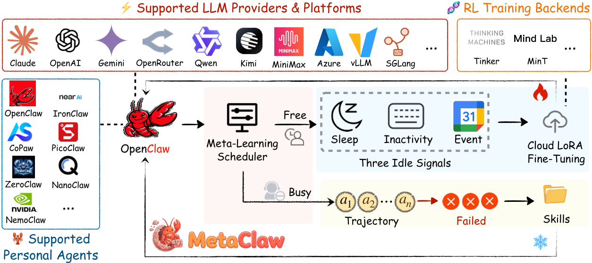
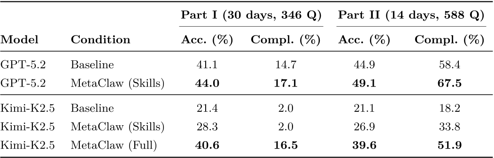
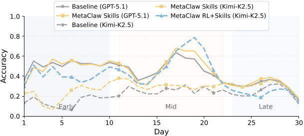
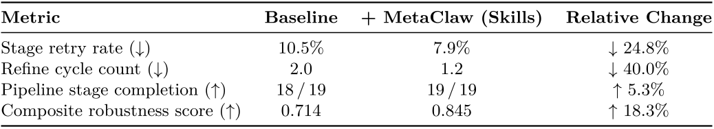

# 每日论文报告 — MetaClaw: 在真实部署中持续元学习与自我进化的 LLM 智能体

## 结构化摘要

| 维度 | 内容 |
|---|---|
| **标题** | MetaClaw: Just Talk – An Agent That Meta-Learns and Evolves in the Wild |
| **机构** | UNC-Chapel Hill, Carnegie Mellon University, UC Santa Cruz |
| **作者** | Peng Xia, Jianwen Chen, Xinyu Yang, Haoqin Tu, Jiaqi Liu, Kaiwen Xiong, Siwei Han, Shi Qiu, Haonian Ji, Yuyin Zhou, Zeyu Zheng, Cihang Xie, Huaxiu Yao |
| **时间** | 2026年3月 |
| **发表** | arXiv preprint |
| **链接** | https://github.com/aiming-lab/MetaClaw |
| **总结** | 本研究旨在解决部署后的 LLM 智能体无法随用户需求演化而持续适应的问题。核心方法是 MetaClaw，一个持续元学习（Continual Meta-Learning）框架，通过两个互补机制——基于技能的快速适应（Skill-driven Fast Adaptation）和机会式策略优化（Opportunistic Policy Optimization）——联合维护一个可演化的技能库与基础 LLM 策略。实验表明，技能驱动的适应可将准确率相对提升最高 32%，完整流水线将 Kimi-K2.5 从 21.4% 提升至 40.6%，并在跨领域任务上展现出良好的泛化能力。 |

---

## 1. 研究背景和问题

在 LLM 智能体（Agent）领域，当前部署的智能体通常是"一次训练、静态服务"的模式，无法随着用户需求的漂移（Task Distribution Drift）而持续改进。现有适应方法可分为三类：基于记忆（Memory-based）的方法存储原始轨迹但无法提炼可迁移的行为模式；基于技能（Skill-based）的方法将经验压缩为可复用指令但不与权重优化协同；基于强化学习（RL-based）的方法更新模型权重但忽略了技能演化后旧轨迹携带过时奖励信号的数据有效性问题。本文的核心问题是：如何在不中断服务的前提下，统一快速的行为级适应与慢速的策略级优化，使智能体在真实部署中持续进化。

### 1.1 核心假设

MetaClaw 基于一个关键观察：两种本质不同时间尺度的适应机制实际上是天然互补的——行为启发式（Behavioral Heuristics）可以在数秒内从单次失败中提炼并立即注入，而跨任务的策略改进则需要基于梯度的优化，耗时数分钟到数小时。两者还具有相互增强效应：更好的策略产生更有信息量的失败用于技能合成，更丰富的技能产生更高奖励的轨迹用于策略优化。

---

## 2. 方法

MetaClaw 将智能体的元模型（Meta-model）定义为 M=(θ, S)，其中 θ 为基础 LLM 策略参数，S 为可演化的技能库（Skill Library）。框架通过两个运行在不同时间尺度上的互补循环来改进该元模型。**技能驱动的快速适应**（Skill-driven Fast Adaptation）是梯度无关的：一个 LLM 技能演化器（Skill Evolver）分析失败轨迹，合成新的行为指令（如"修改文件前先创建 .bak 备份"、"时间字段统一使用 ISO 8601 格式"），这些技能通过系统提示注入，立即对后续任务生效，实现零停机适应。**机会式策略优化**（Opportunistic Policy Optimization）使用基于过程奖励模型（Process Reward Model, PRM）的强化学习（GRPO 算法）通过云端 LoRA 微调更新模型权重 θ，但仅在用户不活跃时触发。机会式元学习调度器（OMLS）监控三类空闲信号：配置的睡眠时间窗口、系统键盘/鼠标空闲检测、以及 Google Calendar 日程占用情况。为防止过时奖励污染，框架引入**技能代际版本控制**（Skill Generation Versioning）机制，严格区分支持数据（Support Data，驱动技能演化的失败轨迹）和查询数据（Query Data，技能更新后收集的适应后轨迹），确保策略优化仅使用反映当前适应行为的有效数据。整个系统基于代理架构（Proxy-based Architecture）构建，无需本地 GPU 即可扩展至生产级 LLM。

---

## 3. 实验

### 3.1 实验设置

| 维度 | 名称 | 数量 |
|---|---|---|
| **模型** | GPT-5.2, Kimi-K2.5 | 2 |
| **训练** | MetaClaw-Bench 模拟工作日任务流（用于 RL 的 5 天训练运行） | 未明确给出样本数 |
| **评测** | MetaClaw-Bench Part I (30天/346题), Part II (14天/588题), AutoResearchClaw (23阶段) | 934 + 23阶段 |
| **指标** | Accuracy (Acc.), File-check Completion Rate (Compl.), Stage Retry Rate, Refine Cycle Count, Pipeline Stage Completion, Composite Robustness Score | 6 |

### 3.2 实验解析

### 3.2.1 MetaClaw-Bench 主实验结果

- **图表内容**：表1报告了五种模型-条件组合（GPT-5.2 Baseline/Skills, Kimi-K2.5 Baseline/Skills/Full）在两个评测部分上的准确率和文件检查完成率。
- **揭示关系**：MetaClaw 在两个模型、两种适应模式和两个评测部分上均一致优于基线。技能注入（Skills）对较弱模型 Kimi-K2.5 带来更大的相对提升（Part I +32.2%），而完整流水线（Full）进一步将 Kimi-K2.5 从 21.4% 提升至 40.6%，几乎追平 GPT-5.2 基线（41.1%）。
- **关键数据**：MetaClaw (Full) 在 Part I 上将 Kimi-K2.5 的端到端任务完成率从 2.0% 提升至 16.5%（8.25 倍），Part II 的文件检查完成率从 18.2% 跳升至 51.9%（+185%）。

### 3.2.2 逐日准确率趋势分析

- **图表内容**：图2展示了五种条件下30天的逐日准确率变化，横轴为天数，纵轴为准确率。实线代表 GPT-5.2，虚线代表 Kimi-K2.5。
- **揭示关系**：所有条件均呈现从早期（day 1-10, >50%）到晚期（day 25-30, <30%）的准确率下降趋势，验证了基准难度递增的设计。MetaClaw 的优势在中期（day 11-22）最为显著，MetaClaw (Full) 在 day 19-20 左右达到近 0.8 的峰值准确率。晚期任务过于复杂，所有条件趋于收敛。

### 3.2.3 AutoResearchClaw 跨领域泛化

- **图表内容**：表2报告了仅使用技能注入（无 RL 权重更新）在 AutoResearchClaw（23阶段自主研究流水线）上的四项鲁棒性指标。
- **揭示关系**：技能注入在无需任何梯度更新的情况下，实现了全面的改进：阶段重试率下降 24.8%，精化周期减少 40.0%，流水线阶段完成率从 18/19 提升至 19/19，综合鲁棒性分数提升 18.3%（0.714→0.845）。这证明了 MetaClaw 的技能注入机制可以跨领域泛化至结构完全不同的长序列智能体工作流。

---

## 4. 局限性与未来工作

### 4.1 原文描述

论文指出当前的一个局限是空闲窗口检测（Idle-window Detection）依赖用户配置（睡眠时间、键盘空闲阈值、Google Calendar 集成），这可能无法泛化到所有部署环境。此外，MetaClaw-Bench 是人工构建的模拟基准而非真实用户会话集合，绝对性能增益可能无法直接迁移到生产工作负载。

### 4.2 模型总结

MetaClaw 作为首个统一技能演化与策略优化的持续元学习框架，其核心创新在于双时间尺度适应机制的互补设计和技能代际版本控制对数据有效性的保障。然而，该方法的局限性还包括：（1）技能库的持续增长可能导致检索质量下降和提示长度膨胀，需要引入技能剪枝或压缩机制；（2）当前仅在 CLI 任务和研究流水线场景验证，更广泛的多模态、多智能体场景下的适用性有待探索；（3）RL 训练的稳定性和效率在更大规模、更长时间的部署中可能面临挑战。未来的研究方向可能包括自适应的空闲检测策略、技能库的自动精简与冲突解决、以及多用户共享技能库的协同学习。（由 Claude Opus 4.6 模型生成）
