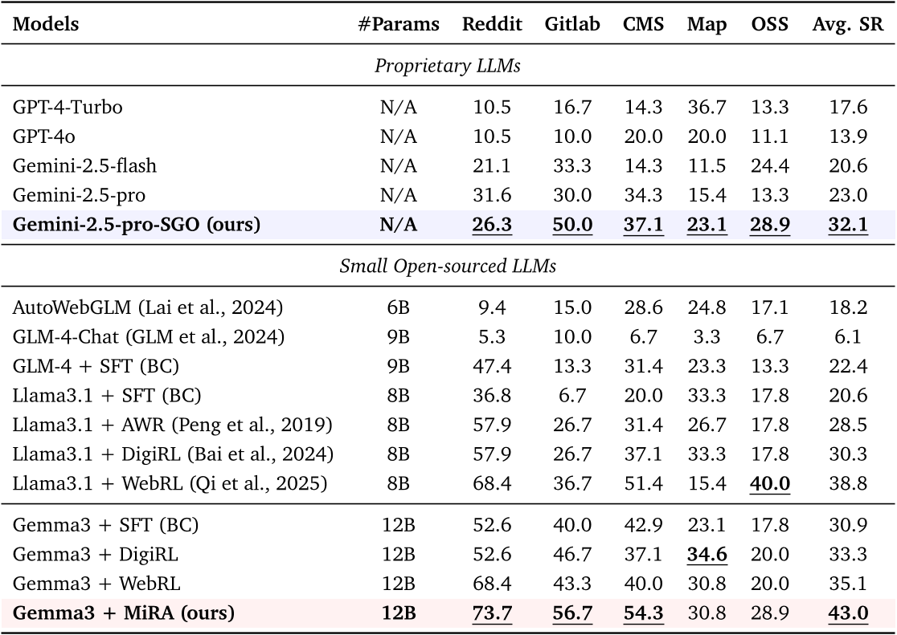
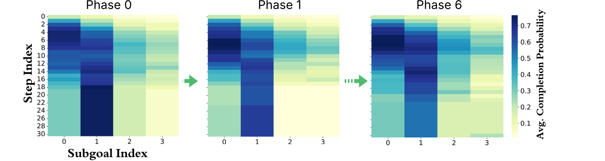

# Daily Paper Reading — A Subgoal-driven Framework for Improving Long-Horizon LLM Agents

## Structured Summary

| Dimension | Content |
|---|---|
| **Title** | A Subgoal-driven Framework for Improving Long-Horizon LLM Agents |
| **Institution** | Google DeepMind |
| **Authors** | Taiyi Wang, Sian Gooding, Florian Hartmann, Oriana Riva, Edward Grefenstette |
| **Date** | 2026-03-23 |
| **Venue** | Arxiv |
| **Link** |  |
| **Summary** | This work addresses the critical planning bottleneck in LLM-based web agents, where agents frequently get stuck in repetitive action loops during long-horizon navigation tasks. The authors propose a dual approach: (1) a subgoal-oriented inference-time planning framework (SGO) that provides dynamic milestoning via retrospective reflection, and (2) MiRA, an offline RL fine-tuning framework using a dual-critic architecture with potential-based reward shaping derived from subgoal completion signals. On WebArena-Lite, the open-source Gemma3-12B model trained with MiRA achieves a 43.0% success rate, surpassing GPT-4-Turbo (17.6%), GPT-4o (13.9%), and the previous open-model SOTA WebRL (38.4%). |

---

## 1. Background and Problem

This research lies at the intersection of LLM-based autonomous agents and web navigation, a challenging testbed for long-horizon sequential decision-making. Current web agents exhibit severe performance degradation as task complexity increases, with proprietary models like Gemini-2.5-Pro showing "mid-task stuck" behaviors in nearly 50% of evaluation trajectories on WebArena-Lite. The core challenge is twofold: during online execution, agents lack structured intermediate objectives to guide progress; during RL fine-tuning, sparse binary rewards (success/failure) make credit assignment across long action sequences extremely difficult.

### 1.1 Core Hypothesis

The paper's central hypothesis is: *"If the final goal is difficult to reach directly, increasing the probability of reaching meaningful intermediate milestones helps."* The authors posit that introducing well-defined milestones can enhance both online interaction (through structured planning) and offline RL fine-tuning (through denser, intermediate rewards), directly targeting the dominant "Get Stuck Midway" failure mode that accounts for 42%–49% of all failures across tested models.

---

## 2. Method

The framework consists of three tightly integrated components. **Subgoal Generation** uses the teacher model Gemini-2.5-pro with iterative in-context learning and randomized few-shot examples to produce ordered intermediate milestones for each task; validation shows an AUROC of 0.84 for subgoal completion scores as a progress predictor. **Dynamic Milestoning (SGO)** enhances inference-time performance by embedding a retrospective reflection loop: at each step, the agent queries its own action history to determine which milestones have been achieved, whether the current subgoal is complete, and what the next target should be—maintaining an explicit binary progress vector z that enables self-correction and re-planning. **MiRA Offline RL Fine-Tuning** introduces a dual-critic architecture: a value critic V_φ trained with binary cross-entropy to model final task success probability, and a potential critic P_ψ trained with MSE regression on linearly interpolated progress labels derived from subgoal completion events. The potential difference ΔP_ψ serves as an auxiliary shaping reward added to the environment reward before computing advantage targets. The policy update uses an MSE regression objective on log-probability ratios (rather than KL divergence or PPO), combined with a doubly-robust advantage estimator that mixes 1-step TD error with Monte-Carlo returns for stability. The entire training is wrapped in an iterative refinement cycle where failed trajectories drive the generation of harder task distributions for subsequent phases, progressively expanding the agent's competence boundary.

---

## 3. Experiments

### 3.1 Experimental Setup

| Dimension | Name | Quantity |
|---|---|---|
| **Models** | GPT-4-Turbo, GPT-4o, Gemini-2.5-Flash, Gemini-2.5-Pro, Gemini-2.5-Pro-SGO, AutoWebGLM (6B), GLM-4-Chat (9B), Llama-3.1 (8B), Gemma-3 (12B) with various fine-tuning variants (SFT, AWR, DigiRL, WebRL, MiRA) | 16 |
| **Training** | Online interaction trajectories from WebArena environment + 1,237 tasks of exploratory rollouts for potential critic pre-training | 1,237 tasks |
| **Evaluation** | WebArena-Lite (5 domains: Shopping Admin, Map, Shopping, Reddit, Gitlab) | 165 tasks |
| **Metrics** | Success Rate (SR), Pass@k (k=1,2,4,8) | 2 |

### 3.2 Experimental Analysis

### 3.2.1 End-to-End Task Success Rate Comparison

- **Figure/Table Content**: Table 3 reports Pass@1 success rates across five web domains (Reddit, Gitlab, CMS, Map, OSS) for all baseline and proposed models, split into proprietary and open-source categories.
- **Revealed Insights**: Both inference-level (SGO) and training-level (MiRA) optimizations yield substantial gains. Gemini-2.5-pro-SGO improves the base Gemini-2.5-pro by ~10 percentage points (23.0% → 32.1%). Gemma3+MiRA achieves the highest average SR of 43.0%, surpassing WebRL (35.1%) and DigiRL (33.3%) by significant margins.
- **Key Data**: MiRA's advantage is most pronounced on Gitlab (56.7%) and CMS/Shopping Admin (54.3%), domains requiring strict procedural dependencies where dense intermediate rewards prove most valuable.

### 3.2.2 MiRA Component Ablation

- **Figure/Table Content**: Figure 11b compares five configurations—full MiRA, without potential critic (w/o PC), with KL divergence instead of MSE (w. KL), without doubly-robust advantage estimation (w/o Doubly Adv.), and AWR baseline—across 6 training phases.
- **Revealed Insights**: Each component addresses a distinct failure mode. Removing the doubly-robust estimator causes catastrophic early-phase collapse to ~25% due to poorly calibrated critic bias. The KL variant reaches only ~33% by Phase 6 (nearly 10% below the full method) because it cannot leverage off-policy data or suppress suboptimal actions. Without the potential critic, learning plateaus at ~35%, confirming that dense shaping is essential for long-horizon credit assignment.
- **Key Data**: Full MiRA achieves ~43% at Phase 6 while all ablated variants fall significantly short, validating the necessity of every component.

### 3.2.3 Subgoal Completion Dynamics

- **Figure/Table Content**: Figure 12 visualizes heatmaps of average subgoal completion probability across timesteps (x-axis) and subgoal indices (y-axis) for Phase 0, Phase 1, and Phase 6.
- **Revealed Insights**: The shift from a static vertical band in Phase 0 (agent stuck on initial subgoals) to a strictly monotonic diagonal frontier in Phase 6 demonstrates that MiRA successfully transforms fragmented, short-horizon attempts into coherent long-horizon trajectories where the agent efficiently chains subgoals in lockstep with the episode timeline.

---

## 4. Limitations and Future Work

### 4.1 Original Description

The authors identify three key future directions: (1) **Learnable milestone synthesis**—transitioning from heuristic prompts to learnable or hierarchical subgoal generators that can dynamically tailor milestone granularity for knowledge-sparse domains. (2) **Non-linear progress estimation**—exploring models that account for varying difficulty across subgoals rather than treating them uniformly via linear interpolation. (3) **Signal annealing strategies**—subgoals should serve as temporary scaffolding that is gradually withdrawn as training progresses, ensuring the final policy optimizes for the true task objective rather than auxiliary rewards. The authors also acknowledge a "cold start" problem: if the agent cannot ground even the initial subgoals, the shaping signal remains silent and optimization degenerates to the sparse-reward regime.

### 4.2 Model Summary

While the results on WebArena-Lite are compelling, the framework's generalization to more diverse, real-world web environments beyond this curated 165-task benchmark remains an open question—particularly for tasks involving cross-application coordination or highly dynamic content. The dependence on a powerful proprietary teacher model (Gemini-2.5-pro) for subgoal generation introduces a practical bottleneck and potential quality degradation on out-of-distribution tasks. The potential critic is trained exclusively on successful trajectories, which may introduce bias toward already-explored regions of the state space. Additionally, the shift from "Stuck Midway" failures to "Wrong Termination" errors (rising to ~31% post-training) suggests that while MiRA resolves the planning bottleneck, it exposes a deeper semantic reasoning limitation in the underlying LLM that warrants separate investigation. Future work could explore end-to-end joint training of subgoal generation and execution policies, as well as extending the milestoning paradigm to multimodal agents operating across desktop, mobile, and API-based environments. (Generated by Claude Opus 4.6)
