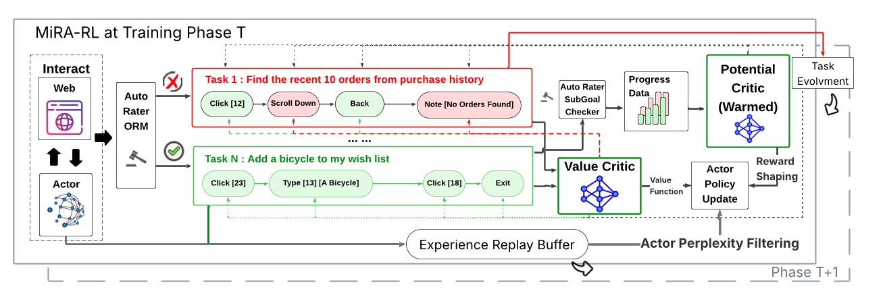
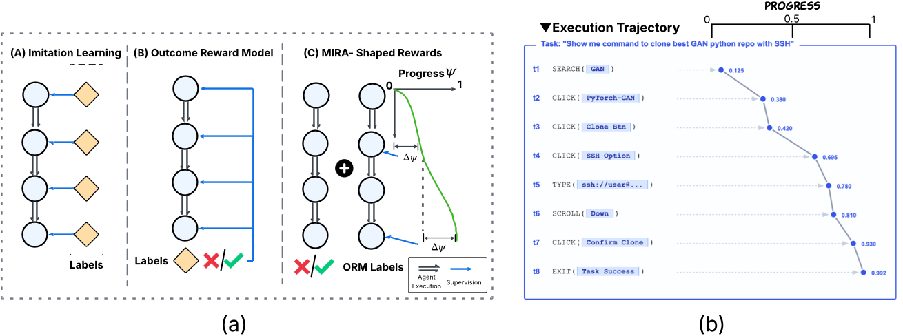

# 每日论文报告 — 基于子目标驱动的长程 LLM 智能体增强框架

## 结构化摘要

| 维度 | 内容 |
|---|---|
| **标题** | A Subgoal-driven Framework for Improving Long-Horizon LLM Agents |
| **机构** | Google DeepMind |
| **作者** | Taiyi Wang, Sian Gooding, Florian Hartmann, Oriana Riva, Edward Grefenstette |
| **时间** | 2026-03-23 |
| **发表** | Arxiv |
| **链接** |  |
| **总结** | 本研究旨在解决 LLM 智能体在长程网页导航任务中因缺乏有效规划而导致的"中途卡顿"（Get Stuck Midway）问题。作者提出了两项核心方法：(1) 基于子目标分解的推理时动态规划框架（SGO），以及 (2) 基于里程碑奖励塑形的离线强化学习微调框架 MiRA（Milestoning your Reinforcement Learning Enhanced Agent），通过双评论家架构和势函数为智能体提供稠密训练信号。在 WebArena-Lite 基准测试上，开源模型 Gemma3-12B 经 MiRA 训练后成功率从 6.4% 跃升至 43.0%，超越 GPT-4-Turbo（17.6%）、GPT-4o（13.9%）及前 SOTA 开源方法 WebRL（38.4%）。 |

---

## 1. 研究背景和问题

本研究属于基于大语言模型（LLM）的自主智能体（Autonomous Agent）领域，聚焦于网页导航（Web Navigation）这一典型长程决策任务。当前 LLM 智能体面临两大核心瓶颈：在在线执行过程中，智能体容易陷入重复动作循环，缺乏清晰的阶段性目标引导；在强化学习微调阶段，稀疏的二元奖励信号（成功/失败）使得信用分配（Credit Assignment）极为困难，智能体无法识别哪些中间步骤对最终成功有贡献。作者通过自动化失败分析器对现有模型进行了定量诊断，发现"中途卡顿"（Get Stuck Midway）是所有模型最主要的失败模式，占比高达 42%–49%，这直接促成了本文方法的设计。

### 1.1 核心假设

本文的核心假设为：**"如果最终目标难以直接达成，那么提高到达有意义的中间里程碑的概率将有助于整体成功"**（原文：*"If the final goal is difficult to reach directly, increasing the probability of reaching meaningful intermediate milestones helps."*）。基于此假设，作者认为引入显式的子目标（Subgoal）既可以在推理时提供结构化规划，也可以在训练时提供稠密的中间奖励信号。

---

## 2. 方法

本文提出的框架包含三个核心组件。首先是**子目标生成**（Subgoal Generation）：利用教师模型 Gemini-2.5-pro，结合少样本上下文学习和随机化示例策略，为每个任务生成一组有序的中间里程碑，经验证其子目标完成分数的 AUROC 达到 0.84，证实子目标是可靠的进展信号。其次是**推理时动态里程碑机制**（Dynamic Milestoning, SGO）：在执行过程中，智能体通过回溯性反思（Retrospective Reflection）回答三个关键问题——"已完成哪些里程碑？""当前子目标是否完成？""下一步应达成什么？"——从而维护显式的进展状态向量 z，实现自我纠错和重新规划。最后是**MiRA 离线强化学习微调**：采用双评论家架构——值评论家 V_φ 建模最终任务成功概率（使用二元交叉熵损失训练），势评论家 P_ψ 预测基于子目标完成的连续进展分数（使用均方误差回归训练）。势评论家的输出差值 ΔP_ψ 作为辅助奖励塑形信号加入环境奖励，提供稠密的梯度信号。策略更新采用基于 MSE 的对数概率比回归（而非标准 KL 散度或 PPO），结合混合 1-step TD 误差和蒙特卡洛回报的双稳健优势估计。整个训练过程通过迭代策略精炼循环实现：每轮训练后收集失败轨迹，生成新的更难任务分布，逐步扩展智能体的能力边界。

---

## 3. 实验

### 3.1 实验设置

| 维度 | 名称 | 数量 |
|---|---|---|
| **模型** | GPT-4-Turbo, GPT-4o, Gemini-2.5-Flash, Gemini-2.5-Pro, Gemini-2.5-Pro-SGO, AutoWebGLM (6B), GLM-4-Chat (9B), Llama-3.1 (8B), Gemma-3 (12B) 及其各种微调变体 | 16 |
| **训练** | WebArena 环境下的在线交互轨迹 + 1237 任务的探索性 Rollout（用于势评论家预训练） | 1237 任务 |
| **评测** | WebArena-Lite（5 个领域：Shopping Admin, Map, Shopping, Reddit, Gitlab） | 165 任务 |
| **指标** | Success Rate (SR), Pass@k (k=1,2,4,8) | 2 |

### 3.2 实验解析

### 3.2.1 端到端任务成功率对比

- **图表内容**：Table 3 展示了所有模型在 WebArena-Lite 五个网站领域（Reddit、Gitlab、CMS、Map、OSS）上的 Pass@1 成功率及平均 SR。上半部分为闭源大模型，下半部分为开源小模型及其各种微调方法。
- **揭示关系**：两个层面均呈现明显提升——推理层面，Gemini-2.5-pro-SGO 比基线 Gemini-2.5-pro 提升约 10 个百分点（23.0% → 32.1%）；训练层面，Gemma3+MiRA 达到 43.0% 的最高 SR，显著超越 WebRL（35.1%）和 DigiRL（33.3%）。
- **关键数据**：MiRA 在 Gitlab（56.7%）和 CMS/Shopping Admin（54.3%）上的优势尤为突出，表明子目标奖励塑形在需要严格过程依赖的复杂多步任务中效果最佳。

### 3.2.2 MiRA 消融实验

- **图表内容**：Figure 11b 比较了五种配置：完整 MiRA、去除势评论家（w/o PC）、使用 KL 散度替代 MSE（w. KL）、去除双稳健优势估计（w/o Doubly Adv.）、以及 AWR 基线，在 6 轮训练中的 SR 变化曲线。
- **揭示关系**：去除任何单一组件均导致明显性能下降——去除双稳健优势估计在早期阶段导致灾难性崩溃至约 25%；使用 KL 替代 MSE 仅达到约 33%（低于完整方法近 10%）；去除势评论家则在约 35% 处饱和，证实稠密奖励塑形对长程信用分配不可或缺。
- **关键数据**：完整 MiRA 在 Phase 6 达到约 43%，而所有消融变体均显著落后，验证了框架中每个组件的必要性。

### 3.2.3 子目标完成动态演化

- **图表内容**：Figure 12 以热力图形式展示了三个训练阶段（Phase 0、Phase 1、Phase 6）中，每个子目标在不同时间步的平均完成概率。
- **揭示关系**：从 Phase 0 的垂直条带（智能体卡在最初 1-2 个子目标）到 Phase 6 的严格单调对角线前沿，展示了 MiRA 成功打破了初始瓶颈，将碎片化的短程尝试转化为连贯的长程轨迹——智能体学会了在时间线上高效串联子目标。

---

## 4. 局限性与未来工作

### 4.1 原文描述

作者指出了三个主要方向：(1) **里程碑合成的改进**——当前依赖启发式提示生成子目标，未来计划引入可学习的或层次化的子目标生成器，以适应知识稀疏的领域；(2) **非线性进展估计**——当前将各子目标视为等难度的线性插值，未来应探索根据子目标难度差异进行非线性进展建模；(3) **信号退火策略**——子目标信号应作为临时"热身"支架，在训练推进过程中逐步撤除，确保最终策略依赖真实任务目标而非过度优化辅助奖励。此外，作者承认 MiRA 存在"冷启动"问题：如果智能体连最初的子目标都难以达成，势函数的塑形信号将保持沉默，优化退化为稀疏奖励模式。

### 4.2 模型总结

本研究在 WebArena-Lite 这一单一基准上展示了显著的实验成果，但其方法在更广泛的真实世界网页交互场景中的泛化能力尚需验证——特别是面对高度动态、需要跨应用协作的复杂任务时。子目标生成依赖于强大的教师模型（Gemini-2.5-pro），这引入了对特定闭源模型的依赖，且子目标质量在分布外任务上可能显著下降。此外，势评论家仅从成功轨迹中学习，可能导致对探索不足区域的偏见。未来可以探索将子目标生成与执行策略进行端到端联合训练，以及将里程碑机制推广到多模态智能体（如桌面操作、移动端）和更开放的任务定义中。（由 Claude Opus 4.6 模型生成）
