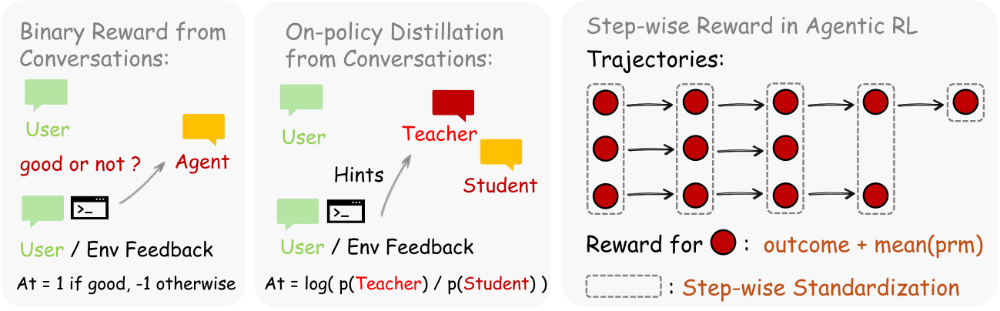
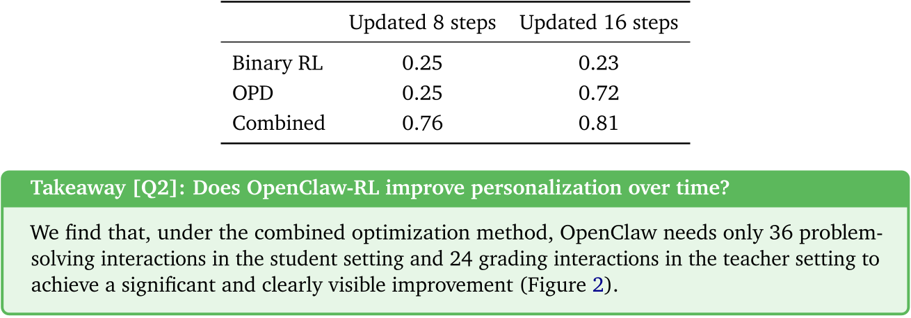
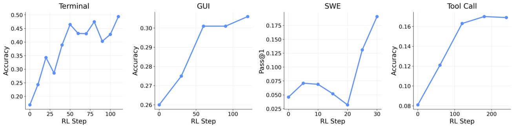
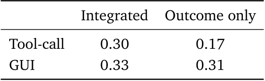

# 每日论文报告 — OpenClaw-RL: Train Any Agent Simply by Talking

## 结构化摘要

| 维度 | 内容 |
|---|---|
| **标题** | OpenClaw-RL: Train Any Agent Simply by Talking |
| **机构** | Princeton University |
| **作者** | Yinjie Wang, Xuyang Chen, Xiaolong Jin, Mengdi Wang, Ling Yang |
| **时间** | 2026-03-10 |
| **发表** | arXiv preprint arXiv:2603.10165v1 |
| **链接** | https://github.com/Gen-Verse/OpenClaw-RL |
| **总结** | 现有智能体强化学习系统浪费了每次交互产生的次态信号（next-state signal），既不将其用于评估也不用于指导训练。本文提出 OpenClaw-RL，通过两种互补方法从次态信号中恢复训练信号：基于过程奖励模型（PRM）的二元强化学习（Binary RL）提取评估性标量奖励，以及基于回看引导在线策略蒸馏（Hindsight-Guided On-Policy Distillation, OPD）提取指令性词元级优势监督。实验表明，组合方法在个人智能体个性化上达到基础分 0.17 → 0.81，在终端、GUI、SWE、工具调用等通用智能体场景中也均取得一致提升。|

---

## 1. 研究背景和问题

本研究属于大语言模型智能体强化学习（Agentic RL）领域。每次智能体交互之后均产生一个次态信号 $s_{t+1}$（用户回复、工具执行结果、GUI 状态变化或测试判决），然而现有系统将其仅作为上下文传递给下一轮，而非用于在线训练，原文将此描述为"两种浪费"（two forms of waste）：**评估性信号**（evaluative signals，隐式评分行动质量）和**指令性信号**（directive signals，指示行动应如何改变）。OpenClaw-RL 旨在统一恢复这两类信号，使一个策略能够同时从个人对话、终端执行、GUI 交互、SWE 任务和工具调用轨迹中学习。

### 1.1 核心假设

次态信号是跨所有交互类型普遍存在的在线学习源，一个策略可以从所有这些信号中同时学习——"next-state signals are universal, and policy can learn from all of them simultaneously"（原文）。在个人智能体场景中，用户无需任何额外操作，智能体在被正常使用过程中即可持续优化。

---

## 2. 方法

OpenClaw-RL 建立在一个完全解耦的异步架构之上，包含四个独立运行的循环：策略服务（Policy Serving，SGLang）、环境托管（Environment，HTTP/API）、PRM 评判（PRM Judging，SGLang/API）和策略训练（Policy Training，Megatron），三者之间零协调开销。对于**个人智能体**，框架提供两种互补的优化方法：其一是**二元强化学习（Binary RL）**，PRM 评判模型通过多数投票 $r_\text{final} = \text{MajorityVote}(r_1,\ldots,r_m)$（其中 $r \in \{+1,-1,0\}$）从次态信号中提取标量过程奖励，以 PPO 风格的截断代理损失（$\varepsilon=0.2$，$\varepsilon_\text{high}=0.28$）更新策略；其二是**回看引导在线策略蒸馏（OPD）**，评判模型从 $s_{t+1}$ 中提炼出 1–3 句简洁的行动修正提示（hint），构造增强教师上下文 $s_\text{enhanced} = s_t \oplus \text{hint}$，并计算词元级方向优势 $A_t = \log \pi_\text{teacher}(a_t \mid s_\text{enhanced}) - \log \pi_\theta(a_t \mid s_t)$，为每个词元提供正向（应增强）或负向（应抑制）的精细监督。组合方法将两种优势线性叠加：$A_t = w_\text{binary} r_\text{final} + w_\text{opd}(\log \pi_\text{teacher} - \log \pi_\theta)$（默认 $w_\text{binary} = w_\text{opd} = 1$）。对于**通用智能体**，框架在可验证结果奖励之上叠加步进式 PRM 奖励，以奖励 $o + \sum_{i=1}^{m} r_i / m$ 提供长时间跨度任务所需的密集信用分配。

---

## 3. 实验

### 3.1 实验设置

| 维度 | 名称 | 数量 |
|---|---|---|
| **模型** | Qwen3-4B（个人智能体）、Qwen3-8B（终端）、Qwen3VL-8B-Thinking（GUI）、Qwen3-32B（SWE）、Qwen3-4B-SFT（工具调用） | 5 |
| **训练** | GSM8K（个人）、SETA RL 数据（终端）、OSWorld-Verified（GUI）、SWE-Bench-Verified（SWE）、DAPO RL 数据（工具调用） | 5 |
| **评测** | GSM8K（个人）、SETA（终端）、OSWorld-Verified（GUI，排除 chrome 和多应用）、SWE-Bench-Verified（SWE）、AIME 2024（工具调用） | 5 |
| **指标** | 平均评分（个人智能体）、准确率 Accuracy（终端/GUI/工具调用）、Pass@1（SWE） | 3 |

### 3.2 实验解析

### 3.2.1 个人智能体：二元 RL 与 OPD 的对比（Table 3）

- **图表内容**：表格对比了 Binary RL、OPD 和组合方法在更新 8 步与 16 步时的平均评分，基础分（base score）为 0.17。
- **揭示关系**：组合方法始终最优（8 步 0.76，16 步 0.81），单独的 Binary RL 提升有限（最高 0.25），而 OPD 在训练样本稀少时起效较慢但后期强于 Binary RL（16 步 0.72），两者形成互补。
- **关键数据**：组合方法 16 步后得分提升至 0.81，相较基础分 0.17 提升约 4.8 倍；仅需 36 次问题求解交互即可达到肉眼可见的显著改进。

### 3.2.2 通用智能体：跨场景统一 RL（Figure 4）

- **图表内容**：四张子图分别展示了终端（Accuracy，100 步）、GUI（Accuracy，120 步）、SWE（Pass@1，30 步）、工具调用（Accuracy，250 步）随 RL 步数的性能变化。
- **揭示关系**：所有四类场景的性能均随训练步数单调提升，验证了同一套 OpenClaw-RL 基础设施可同时驱动不同模态、不同规模的智能体强化学习。
- **关键数据**：终端智能体最终准确率约 0.45+，工具调用从约 0.08 提升至约 0.16，均展现出显著且稳定的提升趋势。

### 3.2.3 过程奖励 vs. 结果奖励的集成效果（Table 4）

- **图表内容**：对比工具调用和 GUI 两个场景下，集成 PRM 步进奖励与仅使用结果奖励时的最终准确率。
- **揭示关系**：在工具调用场景中集成奖励（0.30）远优于仅结果奖励（0.17），GUI 场景中也有小幅提升（0.33 vs 0.31），印证了 PRM 步进信号对长时间跨度任务的必要性。

---

## 4. 局限性与未来工作

### 4.1 原文描述

论文正文及结论部分未显式讨论局限性或未来工作方向。

### 4.2 模型总结

OpenClaw-RL 的核心局限在于：个人智能体实验目前仅在模拟环境（LLM 扮演用户）而非真实部署用户中验证，模拟与真实用户行为的分布差距可能影响结论的可迁移性；OPD 的训练信号高度依赖 PRM 评判模型提炼 hint 的质量，若 hint 提炼出错可能引入噪声甚至负向优化；此外，异步训练框架引入了训练策略与推理策略之间的版本偏差，在高频交互场景下可能影响样本的on-policy属性。未来可探索：将 OpenClaw-RL 部署至真实用户群进行纵向验证、将 OPD 拓展至多模态交互（图像、语音反馈）、以及研究如何在不同用户偏好流之间实现个性化策略的联邦式聚合。（由 Claude Sonnet 4.6 模型生成）
