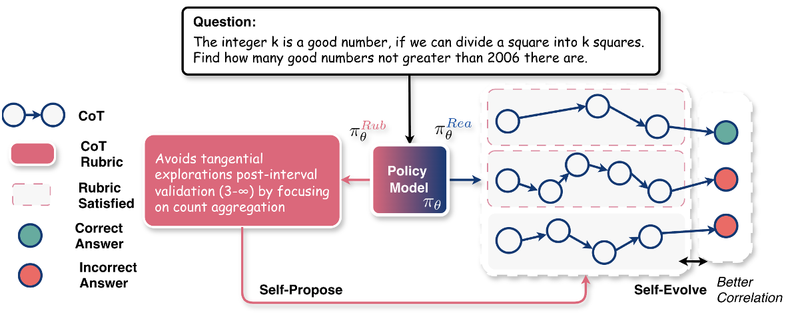
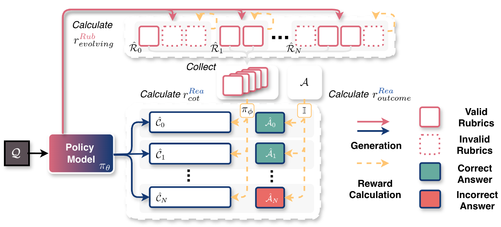
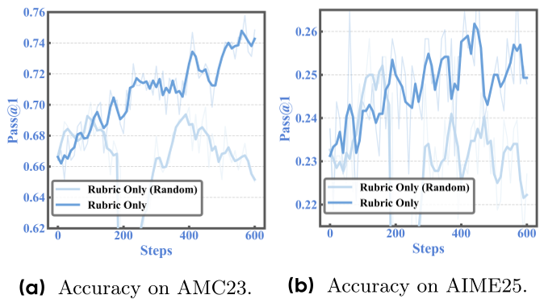
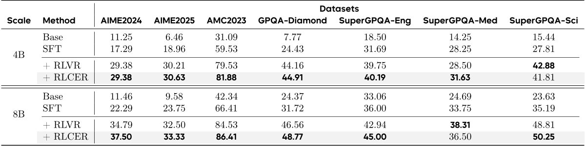
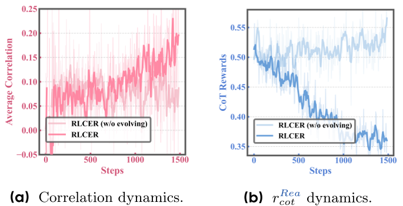

# Daily Paper Reading — Reinforcing Chain-of-Thought Reasoning with Self-Evolving Rubrics

## Structured Summary

| Dimension | Content |
|---|---|
| **Title** | Reinforcing Chain-of-Thought Reasoning with Self-Evolving Rubrics |
| **Institution** | ByteDance Seed, National University of Singapore (NUS), University of Science and Technology of China (USTC) |
| **Authors** | Leheng Sheng, Wenchang Ma, Ruixin Hong, Xiang Wang, An Zhang, Tat-Seng Chua |
| **Date** | February 12, 2026 |
| **Venue** | arXiv preprint |
| **Link** | https://alphalab-ustc.github.io/rlcer-alphalab/ |
| **Summary** | This paper addresses the lack of direct Chain-of-Thought (CoT) supervision in outcome-centric RLVR training. It proposes RLCER, where a single policy model simultaneously acts as a reasoner and a rubricator to self-propose and self-evolve rubrics for CoT reward. RLCER consistently outperforms RLVR across math and general-knowledge reasoning benchmarks, and the generated rubrics further boost inference-time performance when used as in-prompt hints. |

---

## 1. Background and Problem

This paper falls within the subfield of LLM reasoning enhancement via reinforcement learning. The dominant paradigm, Reinforcement Learning with Verifiable Rewards (RLVR), rewards only the correctness of final answers, providing no direct supervision over the reasoning chain (CoT) itself — allowing optimization to drift toward shortcut or brittle strategies [7, 16]. Training an auxiliary process reward model (PRM) requires labor-intensive fine-grained annotations, and a static PRM quickly becomes mismatched as the policy's CoT distribution shifts during training [7]. These challenges motivate a new approach: autonomous CoT rewarding that requires no human annotation and can adapt throughout training.

### 1.1 Core Hypothesis

The paper's central research question is: "Can the policy model self-propose rubrics as CoT supervision criteria and self-evolve them during training with no human annotations?" [§1]. A positive answer would establish a new self-improving paradigm that shifts RL optimization from *what* LLMs answer to *how* LLMs think, yielding "free-lunch" reasoning gains with no additional labeling cost.

---

## 2. Method

RLCER instantiates a single policy model $\pi_\theta$ under two distinct prompts to play two roles. The **Reasoner** $\pi_\theta^{Rea}$ generates a CoT $\hat{C}$ and final answer $\hat{A}$ for a given question $Q$. The **Rubricator** $\pi_\theta^{Rub}$ takes $Q$ and a sampled $\hat{C}$ and produces $K$ textual rubrics $\hat{R} = \{\hat{\tau}_k\}_{k=1}^K$, each consisting of a textual criterion $\hat{c}_k$ (e.g., "avoid tangential explorations post-interval validation") and an importance score $\hat{s}_k$. A separately fine-tuned and frozen **Verifier** $\pi_\phi$ checks rubric satisfaction; a rubric $\hat{\tau}_k$ is deemed *valid* if its binary satisfaction vector $v_k$ is positively correlated with the answer correctness vector $z$ across $N$ sampled rollouts ($\text{corr}(v_k, z) > \alpha$, default $\alpha = 0.2$) and is discriminative ($\text{std}(v_k) > 0$). The CoT reward is computed as the min-max normalized weighted sum of satisfied valid rubrics (Eq. 6). The reasoner's total reward combines this CoT reward with a binary outcome reward ($+1$ / $-1$). The rubricator is rewarded by the fraction of valid rubrics $r^{Rub}_{evolving} = K_{valid}/K$, incentivizing it to propose increasingly informative and challenging rubrics that prevent saturation. Role-specific advantages are computed independently and their gradients are jointly aggregated to update the shared parameters $\theta$ via a DAPO-based clipped PPO objective (Eq. 13). Notably, GRPO is inapplicable here because the rubricator operates under different contexts across rollouts.

---

## 3. Experiments

### 3.1 Experimental Setup

| Dimension | Name | Quantity |
|---|---|---|
| **Models** | Qwen3-8B-Base, Qwen3-4B-Base (cold-start SFT then RL) | 2 |
| **Training** | DAPO-Math-17k math question dataset | 17,000 samples |
| **Evaluation** | AIME2024, AIME2025, AMC2023 (math reasoning); GPQA-Diamond, SuperGPQA-Eng, SuperGPQA-Med, SuperGPQA-Sci (general reasoning) | 7 benchmarks (100 questions per SuperGPQA subset) |
| **Metrics** | pass@1 (average pass rate over 16 sampled responses at temperature 0.7) | 1 |

### 3.2 Experimental Analysis

### 3.2.1 RQ1: Reliability of Self-Proposed Rubrics

- **Figure Content**: Training accuracy curves (rolling average, window=3) on AMC23 and AIME25, comparing a rubric-only reward setting (no outcome reward) against a random rubric baseline where rubric scores are sampled uniformly from [0, 1].
- **Revealed Insights**: The rubric-only setting yields consistent accuracy improvement throughout training, while the random baseline fails to improve and shows abrupt drops around step 200, confirming that self-proposed rubrics produce meaningful RL signals even in the absence of outcome supervision.

### 3.2.2 RQ2: Overall Performance Comparison of RLCER vs. RLVR

- **Table Content**: pass@1 accuracy for Base, SFT, +RLVR, and +RLCER across 7 benchmarks at both 4B and 8B scale.
- **Revealed Insights**: RLCER outperforms RLVR on the majority of benchmarks, with larger gains on the 8B model (AIME2024: 34.79% → 37.50%; GPQA-Diamond: 46.56% → 48.77%). Despite training exclusively on math data, RLCER generalizes to general-knowledge reasoning tasks, demonstrating that self-proposed rubrics provide a "free-lunch" performance boost on top of standard RLVR.

### 3.2.3 RQ3: Mechanism of Rubric Self-Evolution

- **Figure Content**: Training dynamics of the average correlation between rubric satisfaction and answer correctness $\text{corr}(v_k, z)$ (left) and the reasoner's CoT reward $r^{Rea}_{cot}$ (right), comparing RLCER with and without the evolution reward $r^{Rub}_{evolving}$.
- **Revealed Insights**: With the evolution reward enabled, rubric-answer correlation increases monotonically, indicating the rubricator progressively learns to generate more informative rubrics. Simultaneously, the CoT reward trends downward, reflecting escalating rubric difficulty that continuously challenges the reasoner — in contrast, the ablation baseline's rubrics become progressively easier to satisfy, losing their discriminative power.

---

## 4. Limitations and Future Work

### 4.1 Original Description

"On the one hand, the introduction of the rubricator role increases the rollout burden and thereby requires more training time. On the other hand, our method is still quite limited to the RLVR domain, leaving the effectiveness of rewarding with self-proposed rubrics on non-verifiable domains unknown." [§6]

The authors note that future work will explore generalizing RLCER to non-verifiable domains.

### 4.2 Model Summary

RLCER's most fundamental limitation is its restriction to verifiable-reward settings: without a binary verifier, the correlation-based validity criterion for rubrics cannot be computed, leaving open-ended generation and alignment tasks unaddressed. The dual-role architecture also roughly doubles per-step computation (the rubricator must sample $N$ additional rollouts to estimate rubric-answer correlations), limiting scalability to very large models. Additionally, the verifier $\pi_\phi$ is fine-tuned and frozen, making its judgment quality a potential bottleneck; involving it in the self-evolving loop could further improve rubric quality. Promising future directions include adapting the self-evolving rubric mechanism to non-verifiable domains (e.g., replacing the binary verifier with a preference model or LLM judge), reducing rubricator computational overhead through shared computation or rubric caching, investigating rubric transferability across task domains, and studying long-horizon stability of the self-evolution dynamics. (Generated by Claude Sonnet 4.6)
