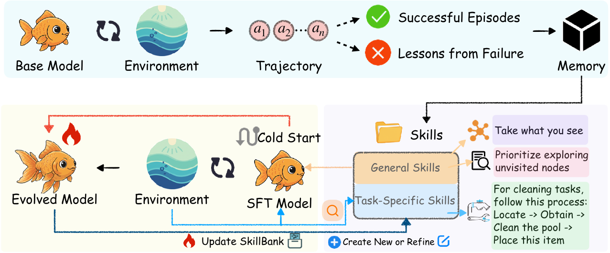
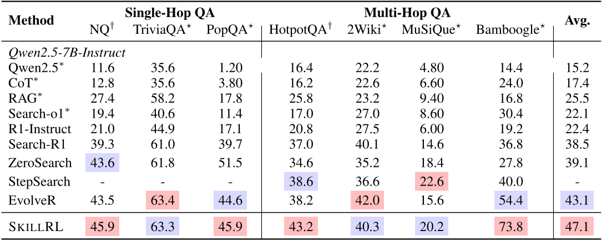
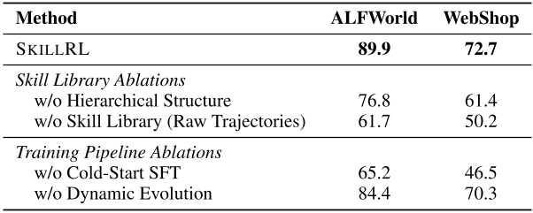
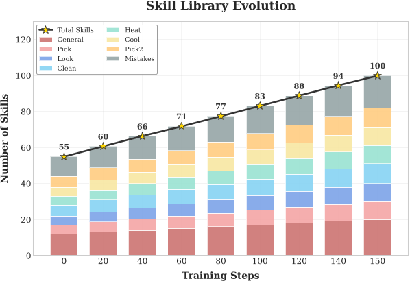

# 每日论文报告 — SKILLRL: 基于递归技能增强强化学习的智能体演化

## 结构化摘要

| 维度 | 内容 |
|---|---|
| **标题** | SKILLRL: Evolving Agents via Recursive Skill-Augmented Reinforcement Learning |
| **机构** | UNC-Chapel Hill、University of Chicago、University of California San Diego |
| **作者** | Peng Xia, Jianwen Chen, Hanyang Wang, Jiaqi Liu, Kaide Zeng, Yu Wang, Siwei Han, Yiyang Zhou, Xujiang Zhao, Haifeng Chen, Zeyu Zheng, Cihang Xie, Huaxiu Yao |
| **时间** | 2026年2月10日 |
| **发表** | arXiv preprint arXiv:2602.08234v1 |
| **链接** | https://github.com/aiming-lab/SkillRL |
| **总结** | 本文旨在解决LLM智能体（LLM agents）无法从历史交互中提炼可复用决策知识的问题。提出SKILLRL框架，通过经验蒸馏（experience distillation）构建层级技能库（SKILLBANK），结合递归技能演化（recursive skill evolution）与RL策略协同优化。在ALFWorld上达89.9%成功率，在WebShop上达72.7%，分别比强基线GRPO提升12.3%和6.6%，并超越GPT-4o等闭源大模型。 |

---

## 1. 研究背景和问题

本研究属于LLM智能体（LLM agents）与强化学习（Reinforcement Learning）交叉领域，核心挑战在于：当前LLM智能体每次任务执行相互独立，无法从过去的成功或失败中积累可迁移知识，导致在复杂长程任务中反复犯相同错误。现有记忆方法（memory-based methods）直接存储原始轨迹（raw trajectories），冗余且噪声重，难以提炼高层次、可复用的行为模式。

### 1.1 核心假设

本文的核心假设是：有效经验迁移需要**抽象**（abstraction）而非记忆——与人类专家类似，智能体应发展出紧凑可复用的"技能"（skills）来捕捉完成子任务的本质策略，而非逐字记忆每一步动作。原文指出："effective experience transfer requires *abstraction*... they develop *skills*, compact and reusable strategies that capture the essence of how to accomplish specific subtasks."

---

## 2. 方法

SKILLRL由三个核心组件构成。**经验蒸馏（experience-based skill distillation）**：基础模型在环境中采集成功轨迹 $\mathcal{T}^+$ 和失败轨迹 $\mathcal{T}^-$，由教师模型 $\mathcal{M}_T$ 分别提炼为正向技能 $s^+ = \mathcal{M}_T(\tau^+, d)$（关键决策模式）和失败教训 $s^- = \mathcal{M}_T(\tau^-, d)$（反事实原则），实现10–20×上下文压缩。**层级技能库SKILLBANK**：技能分为通用技能 $\mathcal{S}_g$（跨任务通用策略，如系统性搜索、状态管理）和任务特定技能 $\mathcal{S}_k$（特定任务类别的领域知识），推理时通过语义相似度检索 $\mathcal{S}_{\text{ret}} = \text{TopK}(\{s \in \mathcal{S}_k : \text{sim}(e_d, e_s) > \delta\}, K)$ 获取相关技能。**递归技能演化（recursive skill evolution）**：在RL训练中，每个验证轮次后针对成功率不达标的类别收集失败轨迹，让教师模型分析覆盖盲区并生成新技能或精炼已有技能，使技能库与智能体策略协同演化。完整训练流程包含冷启动SFT（cold-start SFT）阶段，确保基础模型具备利用技能的能力后再进入GRPO（Group Relative Policy Optimization）强化学习优化。

---

## 3. 实验

### 3.1 实验设置

| 维度 | 名称 | 数量 |
|---|---|---|
| **模型** | Qwen2.5-7B-Instruct（基础模型）、OpenAI o3（教师模型） | 2 |
| **训练** | ALFWorld任务交互轨迹、NQ（Natural Questions）、HotpotQA | 未找到明确样本数 |
| **评测** | ALFWorld（6类子任务）、WebShop、NQ、TriviaQA、PopQA、HotpotQA、2Wiki、MuSiQue、Bamboogle（共9项） | 9个基准 |
| **指标** | 成功率 Success Rate（%）、平均分 Average Score | 2 |

训练超参：GRPO学习率 $1 \times 10^{-6}$，批大小16，组大小8，梯度累积步数4；检索数 $K=6$，失败轨迹收集阈值 $\delta=0.4$。

### 3.2 实验解析

#### 3.2.1 主实验：与SOTA基线对比（ALFWorld & WebShop）

从Table 1的数据（论文第6页）可知，SKILLRL在ALFWorld整体成功率89.9%，WebShop成功率72.7%。

- **图表内容**：Table 1对比了四类方法——闭源LLM、基于提示/记忆的方法、基于RL的方法、记忆增强RL方法——在ALFWorld六类子任务及WebShop上的成功率（%）。
- **揭示关系**：SKILLRL全面领先，尤其在难度最高的Cool（+22%）、Pick2（+23%）、Heat（+15%）等需要多步规划的子任务上超过GRPO，验证了结构化技能先验对稀疏奖励环境下策略学习的加速效果。
- **关键数据**：SKILLRL（89.9% ALFWorld）比GRPO（77.6%）高12.3个百分点，比GPT-4o（48.0%）高41.9个百分点，比Gemini-2.5-Pro（60.3%）高29.6个百分点，7B参数开源模型实现了对大型闭源模型的全面超越。

#### 3.2.2 搜索增强QA任务泛化性

- **图表内容**：Table 2对比了各方法在单跳QA（NQ、TriviaQA、PopQA）和多跳QA（HotpotQA、2Wiki、MuSiQue、Bamboogle）上的准确率（%）及平均分。
- **揭示关系**：SKILLRL平均分47.1%，优于EvolveR的43.1%（+4%）和Search-R1的38.5%（+8.6%），在OOD数据集（如TriviaQA、2Wiki）上保持竞争力，表明蒸馏的搜索策略技能具有任务无关的泛化性。
- **关键数据**：在最难的多跳任务Bamboogle上，SKILLRL达73.8%，比EvolveR（54.4%）高出19.4个百分点，印证了层级技能对多步信息综合的有效引导。

#### 3.2.3 消融实验与技能库演化

- **图表内容（Table 3）**：消融四个设计维度——层级结构、技能库（用原始轨迹替换）、冷启动SFT、动态演化——对ALFWorld和WebShop成功率的影响。
- **揭示关系**：移除层级结构导致ALFWorld下降13.1%，用原始轨迹替换技能库导致最大降幅（约28.2%），冷启动SFT缺失导致24.7%下降，动态演化贡献5.5%提升，全面验证了各组件的必要性。
- **图表内容（Figure 3）**：技能库规模从初始55个（12通用+43任务特定）增长至训练步150时的100个，任务特定技能增长主导（43→80），通用技能稳步增加（12→20），反映智能体对多样失败场景的持续专业化覆盖。

---

## 4. 局限性与未来工作

### 4.1 原文描述

论文结论部分未单独列出局限性章节，仅在结论中简要指出当前工作的核心贡献方向："By distilling raw trajectories into compact, reusable skills and enabling dynamic skill evolution during training, SKILLRL achieves state-of-the-art performance... Our work demonstrates that the abstraction from experience to skill is a powerful principle for building capable, sample-efficient agents." 未明确说明失败案例或方法边界。

### 4.2 模型总结

SKILLRL的主要局限体现在以下几点：其一，技能蒸馏依赖高质量的教师模型（本文用o3），若教师模型能力受限，技能质量可能下降，在资源受限场景下难以复现；其二，当前框架仅在有限域（ALFWorld、WebShop）验证，对开放式或高度动态环境（如真实网络代理、代码执行）的扩展性尚不清晰；其三，SKILLBANK的规模增长策略缺乏显式的技能剪枝或合并机制，长期运行可能导致知识冗余。未来方向可探索：基于更轻量级模型的自蒸馏、跨任务域的技能迁移，以及结合形式化验证的技能质量评估。（由 Claude Sonnet 4.6 模型生成）
