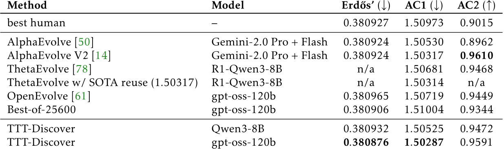
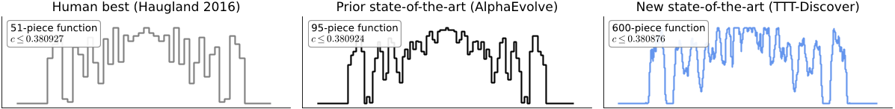
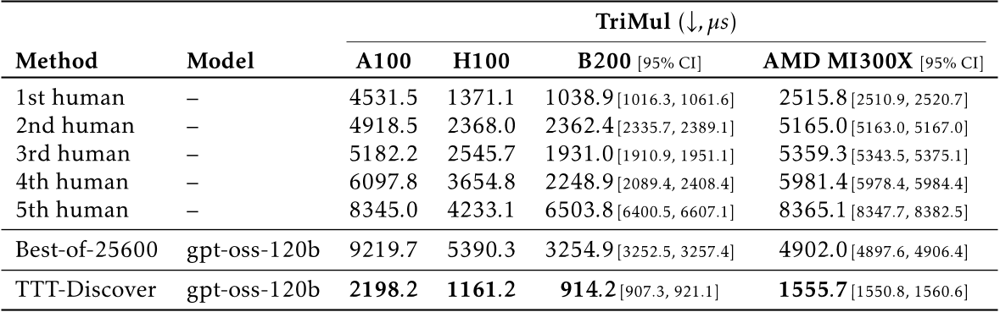
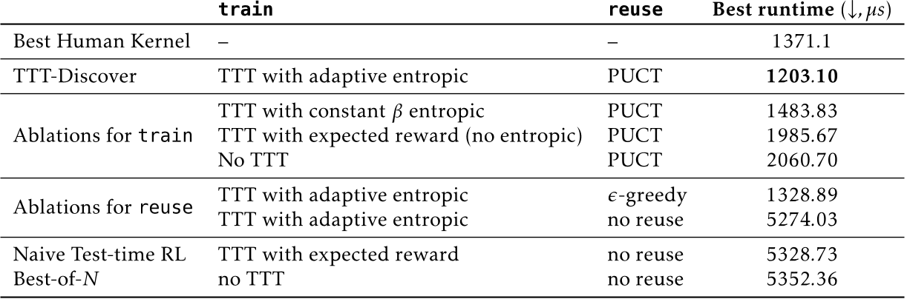
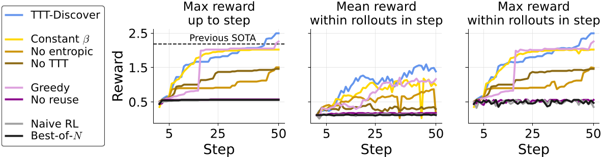

# Daily Paper Reading — Learning to Discover at Test Time

## Structured Summary

| Dimension | Content |
|---|---|
| **Title** | Learning to Discover at Test Time |
| **Institution** | Stanford University, NVIDIA, UC San Diego |
| **Authors** | Mert Yuksekgonul, Daniel Koceja, Xinhao Li, Federico Bianchi, Jed McCaleb, Xiaolong Wang, Jan Kautz, Yejin Choi, James Zou, Carlos Guestrin, Yu Sun |
| **Date** | January 2025 (arXiv: 2601.16175v2) |
| **Venue** | arXiv |
| **Link** | Code publicly released (mentioned in paper) |
| **Summary** | This work addresses the problem of using AI to discover new state-of-the-art solutions for scientific problems. Instead of searching by prompting a frozen LLM, the authors perform reinforcement learning at test time so the LLM can continue to train with experience specific to the test problem. Through an entropic objective that favors maximum-reward actions and a PUCT-based state reuse strategy, TTT-Discover sets new state-of-the-art results across mathematics, GPU kernel engineering, algorithm design, and biology—all using an open model (gpt-oss-120b) at a cost of only a few hundred dollars per problem. |

---

## 1. Background and Problem

Scientific discovery problems require solutions beyond all existing human knowledge, making them fundamentally harder than standard test-time reasoning tasks. Prior work on test-time scaling (e.g., AlphaEvolve) performs search by prompting a frozen LLM to generate many attempts, but the model itself cannot improve from experience—analogous to a student who can never internalize new ideas. Historically, however, learning has superseded search for hard problems such as Go and protein folding. The core question this paper addresses is: **can we perform reinforcement learning at test time so that the LLM continues to improve on a specific scientific problem, thereby achieving genuine discovery?**

### 1.1 Core Hypothesis

The authors argue that discovery problems differ from standard RL in two critical ways: (1) the policy only needs to solve this single problem rather than generalize to others, and (2) only a single best solution matters, not average performance. Therefore, both the learning objective and the search subroutine should strongly favor the most promising solutions.

---

## 2. Method

TTT-Discover models each scientific problem as a Markov Decision Process (MDP) where the state is a candidate solution (e.g., kernel code, mathematical construction), the action is LLM-generated thinking tokens and code, and the reward is provided by the problem's evaluation function (e.g., inverse kernel runtime). The method introduces two key components:

**Entropic Objective**: Unlike standard RL which optimizes expected reward, TTT-Discover uses a parameterized entropic objective $J_{\beta(s)}$ where $\beta$ is adaptively set per initial state by constraining KL divergence. As $\beta \to \infty$, the objective tends toward the maximum reward—exactly what discovery problems require. The adaptive schedule avoids both early training instabilities (from too-large $\beta$) and vanishing advantages later (from too-small $\beta$).

**PUCT State Reuse**: Inspired by Monte Carlo Tree Search, states in the replay buffer are scored using a PUCT rule. The Q-value uses the maximum reward among children (not the mean), a prior proportional to reward rank encourages reusing high-reward states, and an exploration bonus prevents over-exploitation of promising branches. This effectively extends the search horizon, allowing increasingly complex solutions to emerge through iterative refinement.

In practice, TTT-Discover runs gpt-oss-120b on the Tinker platform for 50 training steps, generating 512 rollouts per step (8 groups of 64), using LoRA (rank 32) for parameter-efficient fine-tuning at a total cost of approximately $500 per problem.

---

## 3. Experiments

### 3.1 Experimental Setup

| Dimension | Name | Quantity |
|---|---|---|
| **Models** | gpt-oss-120b, Qwen3-8B | 2 |
| **Training** | Per-problem RL environment | 512 rollouts × 50 steps = 25,600 per run |
| **Evaluation** | Erdős minimum overlap, autocorrelation inequalities (AC1/AC2), circle packing, TriMul kernel competition (A100/H100/B200/MI300X), MLA-Decode, AtCoder AHC039/AHC058, single-cell RNA-seq denoising | 10+ tasks |
| **Metrics** | Upper/lower bounds, kernel runtime (µs), competition score, MSE, Poisson NLL | 5+ |

### 3.2 Experimental Analysis

### 3.2.1 Mathematics Discovery Results

- **Figure/Table Content**: Table 2 summarizes TTT-Discover's performance on three mathematics problems, comparing against best human results, AlphaEvolve variants, ThetaEvolve, OpenEvolve, and Best-of-N baselines.
- **Revealed Insights**: TTT-Discover reduces the upper bound on Erdős' minimum overlap from 0.380924 (AlphaEvolve) to 0.380876—an improvement 16× larger than AlphaEvolve's improvement over the best human result. For the first autocorrelation inequality, it certifies $C_1 \leq 1.50287$, a new state-of-the-art.
- **Key Data**: Even with the weaker Qwen3-8B model, TTT-Discover outperforms AlphaEvolve (which uses Gemini-2.0 Pro+Flash) on both autocorrelation inequalities.

- **Figure/Table Content**: Figure 2 shows the normalized step functions constructed by the best human (51-piece), AlphaEvolve (95-piece), and TTT-Discover (600-piece).
- **Revealed Insights**: TTT-Discover discovered a 600-piece asymmetric construction, qualitatively different from prior symmetric solutions, demonstrating the method's ability to find fundamentally novel solution structures.

### 3.2.2 GPU Kernel Engineering Results

- **Figure/Table Content**: Table 4 reports TTT-Discover's kernel runtimes on four GPU types for the TriMul competition, compared against the top-5 human submissions and Best-of-25600.
- **Revealed Insights**: TTT-Discover achieves state-of-the-art across all GPU types. On A100 (2198µs vs 4531µs), it is over 50% faster than the best human; on H100 (1161µs vs 1371µs), approximately 15% faster—despite training only with H100 reward evaluation, the kernels generalize to other GPU architectures.
- **Key Data**: The Best-of-25600 baseline (9219µs on A100, 5390µs on H100) falls far short of human performance, demonstrating that sampling alone cannot solve these problems and learning is essential.

### 3.2.3 Ablation Study

- **Figure/Table Content**: Table 8 ablates both the training objective and the reuse strategy on the TriMul H100 competition.
- **Revealed Insights**: The full TTT-Discover (adaptive entropic + PUCT) achieves the best runtime at 1203µs. Removing the entropic objective (using expected reward) degrades to 1985µs; replacing PUCT with ε-greedy yields 1328µs; removing reuse entirely collapses to 5274µs, comparable to Best-of-N at 5352µs. Both components are essential.

- **Figure/Table Content**: Figure 4 shows the maximum and mean reward trajectories over 50 training steps for each ablation configuration.
- **Revealed Insights**: TTT-Discover's maximum reward steadily climbs and surpasses the human SOTA; the constant-β variant plateaus in later steps; configurations without TTT or without reuse show minimal improvement, with their curves clustered at the bottom.

---

## 4. Limitations and Future Work

### 4.1 Original Description

The authors explicitly state that TTT-Discover in its current form can only be applied to problems with continuous rewards. The most important future direction is extending test-time training to problems with sparse or binary rewards, or problems in non-verifiable domains. Additionally, in the single-cell analysis application, the authors note that benchmark metric improvements do not guarantee biological validity for downstream tasks.

### 4.2 Model Summary

The central limitation of TTT-Discover is its strong dependence on continuous, verifiable reward signals—which excludes many practical scientific problems (e.g., theorem proving, discrete decision problems in drug design). While the per-problem cost is relatively modest (~$500), it still requires scalable RL infrastructure and sufficient GPU compute, limiting broader reproducibility. The environment design (reward function, state definition, validation logic) is heavily domain-dependent, meaning transferability hinges on the ability to formulate appropriate MDP environments for new domains. Future research directions could include combining process reward models or LLM-as-judge techniques to handle sparse/non-verifiable rewards, as well as exploring knowledge transfer across problems rather than the current single-problem isolation paradigm. (Generated by Claude Opus 4.6 model)
