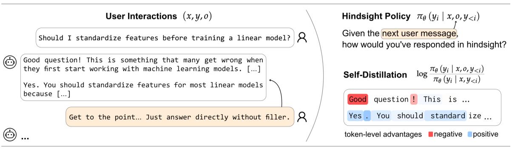
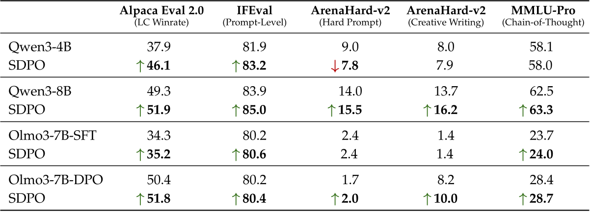
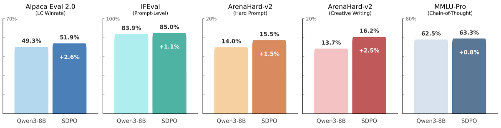
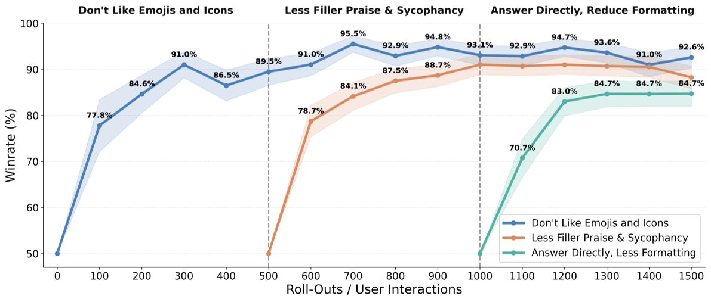

# 每日论文报告 — Aligning Language Models from User Interactions

## 结构化摘要

| 维度 | 内容 |
|---|---|
| **标题** | Aligning Language Models from User Interactions |
| **机构** | ETH Zurich、MIT、University of Zurich |
| **作者** | Thomas Kleine Buening, Jonas Hübotter, Barna Pásztor, Idan Shenfeld, Giorgia Ramponi, Andreas Krause |
| **时间** | 2026年2月18日 |
| **发表** | arXiv:2603.12273v1 [cs.CL] |
| **链接** | — |
| **总结** | 本研究旨在解决如何直接从多轮用户交互中学习以对齐语言模型的问题。核心方法是 SDPO（Self-Distillation Policy Optimization，自蒸馏策略优化），通过将用户的后续消息作为事后（hindsight）上下文重新提示同一模型，获得 token 级优势信号，并将其蒸馏回当前策略。在真实用户对话数据集 WildChat 上训练后，多个模型家族的对齐与指令遵循基准测试均获得提升，且不损害其他能力；同一机制还支持无需显式反馈的持续个性化适应。 |

---

## 1. 研究背景和问题

大语言模型的推理阶段每天产生海量的多轮用户对话数据，但这些数据通常被直接丢弃，未被用于改进模型自身。用户的后续消息（如错误报告、格式要求、风格修正）隐含着丰富的对齐信号，现有方法（如 RLHF、DPO）无法直接利用这些原始交互数据，因为其缺乏明确的标注、奖励或偏好比较。本文提出的核心问题是：**能否以简单、有原则且可扩展的方式直接从多轮用户交互中训练语言模型？**

### 1.1 核心假设

本文的核心观察是：语言模型已具备在上下文中利用后续消息修正自身行为的能力（即上下文学习，in-context learning）。基于此，作者假设可以将"事后信息"（hindsight，即用户的下一条消息）编码为一个蒸馏目标，从而将这种上下文中的行为改变永久蒸馏进模型权重中，而无需任何额外的奖励模型或偏好标注。

---

## 2. 方法

SDPO 将每轮用户交互形式化为三元组 $(x, y, o)$：对话历史 $x$、模型回复 $y$、用户后续消息 $o$。核心思路是构造一个**事后策略**（hindsight policy）$\pi_\theta(\cdot \mid x, o)$——将用户的后续消息 $o$ 拼入提示词，让同一个模型"假装已知用户反馈"后重新生成。通过比较事后策略与原始策略在每个 token 上的对数概率差，得到 token 级优势 $A_i(x,y,o) := \log \pi_\theta(y_i \mid x, o, y_{<i}) - \log \pi_\theta(y_i \mid x, y_{<i})$，正值 token 被强化，负值 token 被惩罚。训练目标为最小化原始策略与（stop-gradient 的）事后策略之间的逐 token 反向 KL 散度：$\mathcal{L}_{\text{SDPO}}(\theta) = \sum_i \mathrm{KL}(\pi_\theta(\cdot \mid x, y_{<i}) \,\|\, \bar{\pi}_\theta(\cdot \mid x, o, y_{<i}))$。当使用离线日志数据（WildChat 中的对话由 GPT-3.5/GPT-4 生成，属于 off-policy 情形）时，直接在交互元组上优化该目标的替代版本，无需访问行为策略的概率。从理论上看（命题 3.1），在理想化假设下，序列级自蒸馏优势等价于用户的潜在奖励函数减去一个归一化项，即 SDPO 隐式地优化了用户的潜在偏好。

---

## 3. 实验

### 3.1 实验设置

| 维度 | 名称 | 数量 |
|---|---|---|
| **模型** | Qwen3-4B, Qwen3-8B, Olmo3-7B-Instruct-SFT, Olmo3-7B-Instruct-DPO | 4 |
| **训练** | WildFeedback（约 14,000 条对话，~50,000 个三元组）；WildChat（随机采样 14,000 条对话，~50,000 个三元组） | ~50,000 |
| **评测** | AlpacaEval 2.0, IFEval (Prompt-Level), ArenaHard-v2 (Hard Prompt & Creative Writing), MMLU-Pro (Chain-of-Thought)；预训练基准：TruthfulQA, HellaSwag, CommonsenseQA | 5 主要基准 + 3 预训练基准 |
| **指标** | LC Winrate (%), Prompt-Level Accuracy (%), Pass Rate (%), CoT Accuracy (%) | 4 |

### 3.2 实验解析

#### 3.2.1 通用对齐：跨模型家族的主实验结果

- **图表内容**：该表对比了 Qwen3-4B、Qwen3-8B、Olmo3-7B-SFT、Olmo3-7B-DPO 在五个基准上经过 SDPO 训练前后的性能，行为"基线模型 vs. SDPO"对比，箭头仅在变化超过 0.1 个百分点时显示。
- **揭示关系**：SDPO 在几乎所有模型和基准上均带来了提升，且不损害其他能力，表明从原始用户交互中学习是可行且稳健的。
- **关键数据**：Qwen3-8B 在 AlpacaEval 2.0 上从 49.3% 升至 51.9%（+2.6%），在 ArenaHard Creative Writing 上从 13.7% 升至 16.2%（+2.5%）；Qwen3-4B 在 AlpacaEval 2.0 上涨幅最大（+8.2%，37.9→46.1%）。

#### 3.2.2 使用真实用户对话训练的基准提升概览

- **图表内容**：该柱状图展示了 Qwen3-8B 在 14,000 条真实用户对话上训练前后，五个基准的性能对比（AlpacaEval 2.0、IFEval、ArenaHard-v2 Hard Prompt、ArenaHard-v2 Creative Writing、MMLU-Pro Chain-of-Thought）。
- **揭示关系**：所有五个基准均有提升，且提升一致性强，说明 SDPO 不是针对特定任务的过拟合，而是捕获了通用的对齐信号。

#### 3.2.3 持续个性化：无灾难性遗忘

- **图表内容**：该折线图展示了对单个 Qwen3-8B 模型在线训练 1500 次交互（三种用户偏好依次引入，每种 500 次）过程中，每种偏好对应的 win rate 变化曲线。每条曲线衡量的是相对于该偏好刚引入时的基准模型的胜率。
- **揭示关系**：新偏好被快速学习，同时早期已学习的偏好不会被遗忘，三条曲线在后期均维持在高胜率水平，表明 SDPO 能够在不牺牲旧偏好的前提下持续积累新偏好。
- **关键数据**：三种偏好（不喜欢 Emoji、减少谄媚填充语、直接回答减少格式）在各自对应的 500 次交互窗口内，胜率均从约 50% 快速攀升至 90% 以上。

---

## 4. 局限性与未来工作

### 4.1 原文描述

论文在 Discussion 部分指出，直接从用户交互中学习引入了重要的安全和伦理问题：用户的后续消息可能隐式地鼓励逃避、误导或违反策略的行为，持续个性化在没有额外防护机制的情况下存在被恶意用户利用的风险（将模型引向不安全行为）。SDPO 虽然自然地抑制了来自无关交互的更新，但其本身无法区分良性与对抗性学习信号。论文建议，收集和使用用户交互数据进行学习必须辅以适当的透明度、知情同意和治理机制。

### 4.2 模型总结

SDPO 的主要局限性在于：（1）事后策略的构建依赖模型本身具有较强的上下文学习能力，对于较小或欠对齐的模型（如 Qwen3-4B 在数学编码任务上出现了轻微退化），学习信号质量有所下降；（2）当前方法仅利用用户的直接后续消息，而忽略了更长距离的多轮反馈模式，限制了可利用的信号丰富度；（3）离线 off-policy 变体的梯度估计存在偏差，如何设计无偏的 off-policy 校正是一个开放问题。未来工作可探索：将 SDPO 扩展至更长对话上下文的多跳信号提取、与安全过滤机制的结合、以及在持续部署场景下的分布偏移问题。（由 Claude Sonnet 4.6 模型生成）
