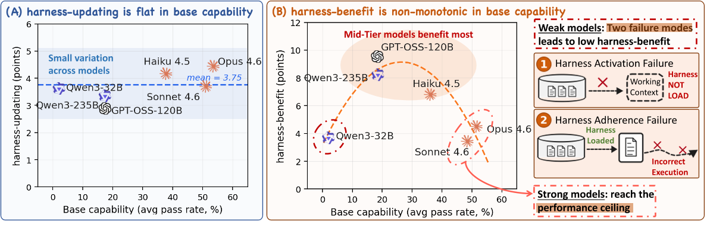
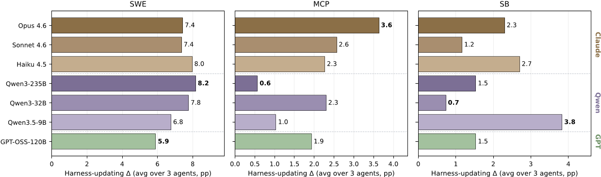
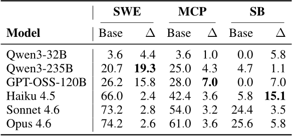
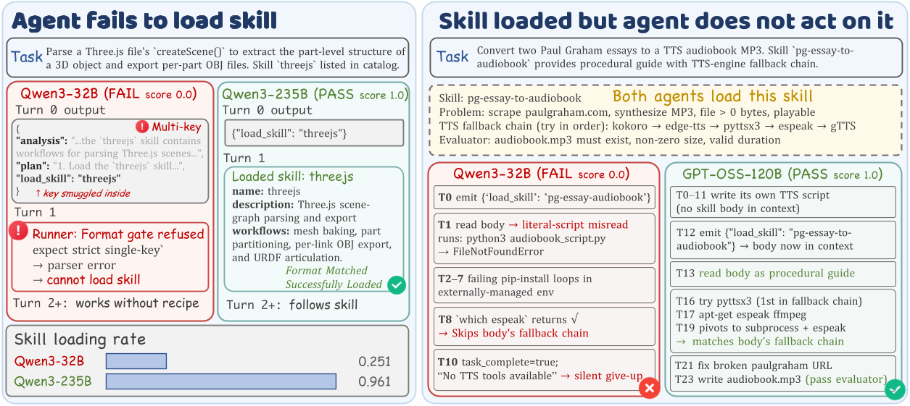

# 每日论文报告 — Harness Updating Is Not Harness Benefit: Disentangling Evolution Capabilities in Self-Evolving LLM Agents

## 结构化摘要

| 维度 | 内容 |
|---|---|
| **标题** | Harness Updating Is Not Harness Benefit: Disentangling Evolution Capabilities in Self-Evolving LLM Agents |
| **机构** | The Pennsylvania State University, UC Santa Cruz, Amazon |
| **作者** | Minhua Lin, Juncheng Wu, Zijun Wang, Zhan Shi, Yisi Sang, Bing He, Zewen Liu, Tianxin Wei, Zongyu Wu, Zhiwei Zhang, Dakuo Wang, Xiang Zhang, Benoit Dumoulin, Cihang Xie, Yuyin Zhou, Suhang Wang, Hanqing Lu |
| **时间** | 2025年5月 |
| **发表** | Arxiv |
| **链接** |  |
| **总结** | 该研究旨在解决自进化（self-evolving）LLM 智能体中，模型的基础能力与其在框架自进化（harness self-evolution）中表现之间关系不明确的问题。研究将框架自进化能力分解为两个独立维度：框架更新能力（harness-updating）和框架受益能力（harness-benefit），并在三个基准测试和七个 LLM 上进行系统实验。主要发现是：框架更新能力在不同基础能力层级的模型之间差异很小（甚至 Qwen3.5-9B 的更新效果可比肩 Claude Opus 4.6），而框架受益能力呈非单调关系——中等能力模型获益最大，弱模型因无法激活或遵循框架而获益最少。 |

---

## 1. 研究背景和问题

当前 LLM 智能体（LLM Agent）越来越多地被部署为围绕可编辑外部框架（harness）构建的系统，这些框架包括提示词（prompts）、技能（skills）、记忆（memories）和工具（tools）。框架自进化（harness self-evolution）通过从执行证据中更新框架来适应部署环境，但现有评估仅报告端到端的性能提升，无法区分提升究竟来自进化器（evolver）产生了更好的框架更新，还是任务求解智能体（task-solving agent）更有效地利用了更新后的框架。本文提出并回答两个核心问题：哪些模型能产生有用的框架更新？哪些模型能从更新后的框架中获益最多？

### 1.1 核心假设

本文的核心假设是：模型的基础任务求解能力（base capability）与其在框架自进化中的两种能力——框架更新能力和框架受益能力——之间存在系统性的解耦（decoupling）。具体而言，作者假设更强的基础能力并不必然意味着更好的框架更新能力或更高的框架受益。

---

## 2. 方法

本文提出了一套形式化的框架自进化协议和能力度量体系。智能体被定义为模型骨干 f 与框架状态 H 的组合 A = (f, H)，其中模型权重固定，仅更新框架的可编辑组件。进化器（evolver）根据执行证据 D 对框架 H 进行增量更新。在此基础上，作者定义了三个关键指标：（1）基础能力 M_base(f)，即模型在初始框架下的任务求解表现；（2）框架更新能力 Δ_update(e)，即固定任务求解智能体、变换进化器时的平均提升；（3）框架受益能力 Δ_benefit(f)，即固定进化器、变换任务求解智能体时的最大提升。实验采用"交叉配对"设计：七个 LLM 分别作为智能体和进化器，在三个基准测试（SWE-bench Verified、MCP-Atlas、SkillsBench）上进行全矩阵实验，所有配对共享相同的初始框架、任务流和提示模板，仅 LLM 骨干不同，从而实现对两种能力的独立度量。

---

## 3. 实验

### 3.1 实验设置

| 维度 | 名称 | 数量 |
|---|---|---|
| **模型** | Claude Opus 4.6, Claude Sonnet 4.6, Claude Haiku 4.5, Qwen3-235B-A22B, Qwen3-32B, GPT-OSS-120B, Qwen3.5-9B | 7 |
| **训练** | 未涉及训练（框架自进化不更新模型权重） | N/A |
| **评测** | SWE-bench Verified (SWE), MCP-Atlas (MCP), SkillsBench (SB) | 3 |
| **指标** | Pass Rate, Harness-updating Gain (Δ_update), Harness-benefit Gain (Δ_benefit), Skill-Load Rate (SLR), Harness-Following Rate (HFR) | 5 |

### 3.2 实验解析

### 3.2.1 框架更新能力分析（Evolver-side Analysis）

- **图表内容**：Figure 3 展示了七个模型作为进化器时在三个基准测试上的框架更新能力 Δ_update（以百分点 pp 为单位），横轴为各进化器模型，按模型家族（Claude、Qwen、GPT）分组。
- **揭示关系**：框架更新能力在不同基础能力层级之间表现平坦（flat），最强与最弱进化器之间的差距在任一基准测试上至多 3.1 pp，且没有单一模型在所有基准上占优。
- **关键数据**：最小的模型 Qwen3.5-9B 在 SkillsBench 上取得了最高的更新增益（3.8 pp），超过了 Claude Opus 4.6（2.3 pp）和 Qwen3-235B（1.5 pp）。

### 3.2.2 框架受益能力分析（Agent-side Analysis）

- **图表内容**：Table 1 展示了六个模型作为任务求解智能体时的基础通过率（Base, %）和框架受益增益 Δ_benefit（pp），覆盖三个基准测试。
- **揭示关系**：框架受益能力呈非单调关系——中等能力模型获益最大（如 Qwen3-235B 在 SWE 上获益 19.3 pp，GPT-OSS-120B 在 MCP 上获益 7.0 pp），而弱模型（如 Qwen3-32B）和强模型（如 Opus 4.6）获益均较少。强模型的低增益可归因于性能天花板效应，而弱模型的低增益则源于两种失败模式。
- **关键数据**：Opus 4.6 在 SWE 上基础通过率已达 74.2%，增益仅 2.6 pp；而基础仅 20.7% 的 Qwen3-235B 增益高达 19.3 pp。

### 3.2.3 弱模型的两种失败模式分析

- **图表内容**：Figure 7 通过两个具体案例展示了弱模型在 SkillsBench 上的失败模式：左侧为框架激活失败（harness activation failure），Qwen3-32B 将技能加载请求嵌入多键操作中导致加载失败；右侧为框架遵循失败（harness adherence failure），模型虽加载了技能但未按其指导执行。
- **揭示关系**：弱模型的技能加载率（SLR）远低于强模型（Qwen3-32B 仅 0.251，Opus 4.6 为 0.957），且即使成功加载框架，弱模型的遵循率（HFR）也显著更低（Qwen3-32B 为 0.142，Opus 4.6 为 0.757）。此外，弱模型的遵循程度随轨迹展开急剧衰减（Qwen3-32B 从 0.52 降至 0.13），而强模型保持稳定（Opus 4.6 从 0.89 降至 0.80）。

---

## 4. 局限性与未来工作

### 4.1 原文描述

作者明确指出以下局限性：（1）研究仅关注框架自进化，不涉及参数微调、强化学习或混合适应方法；（2）模型集合具有代表性但并非穷举，更广泛的模型网格有助于进一步明确框架更新和受益能力如何随模型家族、规模、训练方案和部署成本变化；（3）框架自进化在开放部署中可能带来安全风险，如不正确的经验、不安全的工具使用规则或敏感信息可能被写入框架并被后续智能体复用。

### 4.2 模型总结

本研究的核心贡献在于揭示了框架自进化中"更新"与"受益"两种能力的系统性解耦，为智能体系统设计提供了明确的资源分配指导。然而，研究的实验设计基于固定的提示模板和进化协议，可能无法完全反映不同进化策略（如基于代码的框架优化）对结果的影响。此外，关于弱模型的两种失败模式（激活失败和遵循失败）的诊断虽然深入，但如何通过智能体训练有效弥补这些缺陷（特别是长程指令遵循能力）仍需进一步研究。未来方向可能包括：将框架调用作为智能体训练的一等公民技能、设计针对长程轨迹中指令遵循衰减的训练目标、以及探索参数更新与框架进化的协同优化。（由 Claude Opus 4.6 模型生成）
