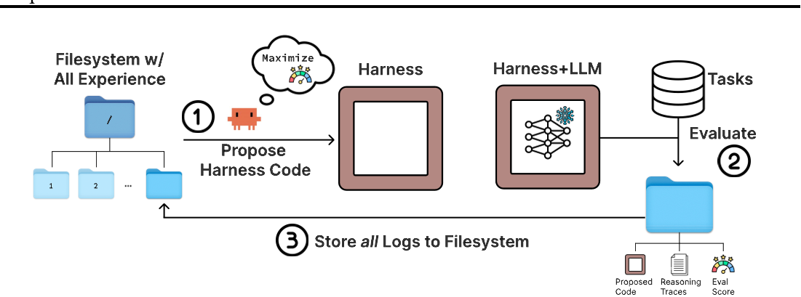
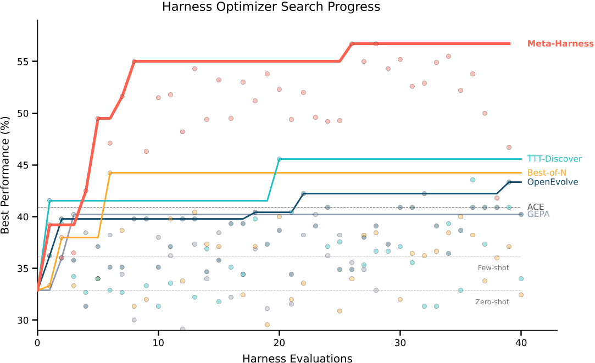
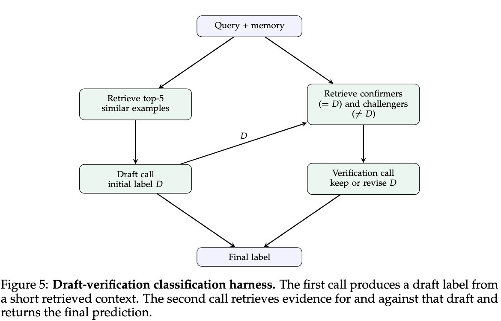
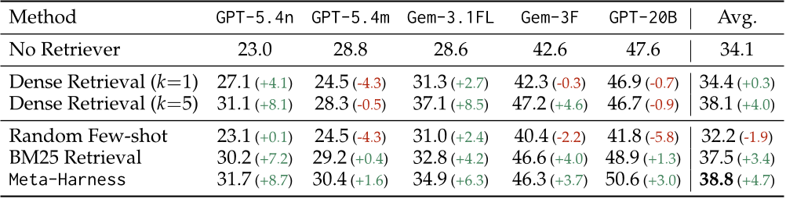
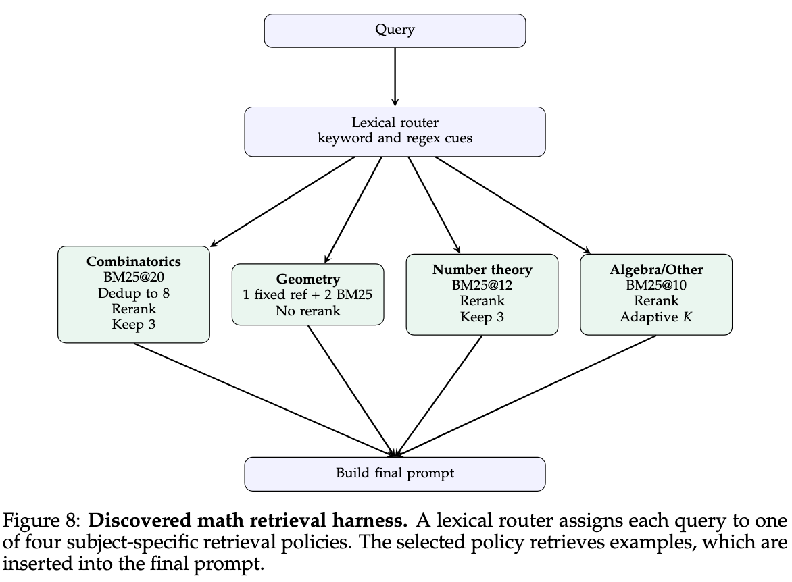
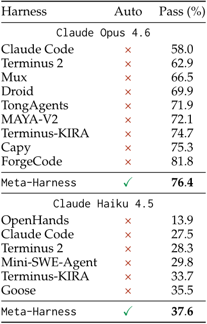
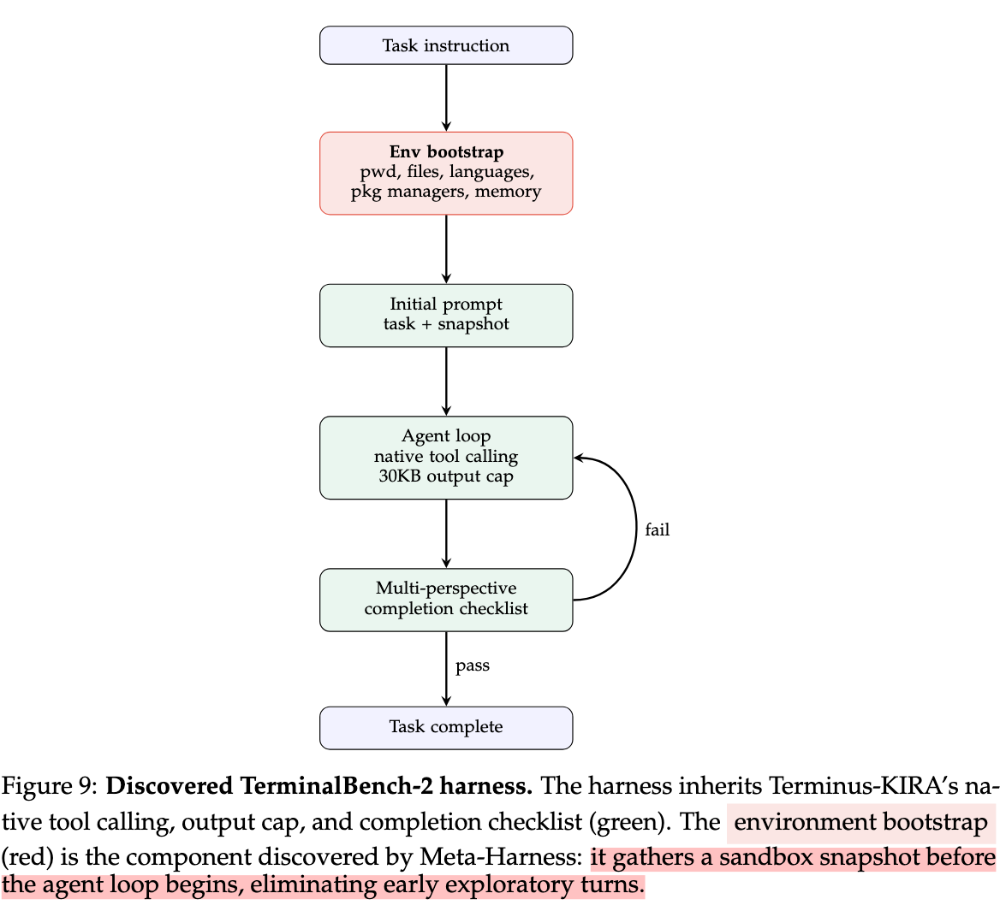

# 每日论文报告 — Meta-Harness: End-to-End Optimization of Model Harnesses

## 结构化摘要

| 维度 | 内容 |
|---|---|
| **标题** | Meta-Harness: End-to-End Optimization of Model Harnesses |
| **机构** | Stanford, MIT, KRAFTON |
| **作者** | Yoonho Lee, Roshen Nair, Qizheng Zhang, Kangwook Lee, Omar Khattab, Chelsea Finn |
| **时间** | 2026 (Preprint) |
| **发表** | Preprint |
| **链接** | 项目主页: https://yoonholee.com/meta-harness/ ；代码: https://github.com/stanford-iris-lab/meta-harness-tbench2-artifact |
| **总结** | 本研究旨在解决 LLM 系统中 harness（围绕模型的代码，决定存储、检索和呈现给模型的信息）仍然依赖手工设计的问题。作者提出 Meta-Harness，一个外循环（outer-loop）系统，通过编码智能体（coding agent）在文件系统中选择性地检查先前候选方案的源代码、评估分数和执行轨迹，自动搜索最优的 harness 代码。在在线文本分类任务上，Meta-Harness 比最优手工设计的 harness（ACE）提升 7.7 个百分点，同时上下文 token 用量减少 4 倍；在数学推理任务上平均提升 4.7 个百分点；在 TerminalBench-2 上超越了最佳手工设计的 baseline。 |

---

## 1. 研究背景和问题

LLM 系统的性能不仅取决于模型权重，还高度依赖其 harness——决定向模型存储、检索和展示什么信息的代码。改变同一模型的 harness 可在同一 benchmark 上造成 6 倍的性能差距。然而，harness 工程（Harness Engineering）目前仍主要依赖手工设计，现有的文本优化器（text optimizer）由于过度压缩反馈信号——要么仅依赖标量分数、要么将反馈限制在短模板或摘要中——难以有效处理 harness 优化所需的长程依赖信息。本文的核心问题是：能否通过让提议器（proposer）完整访问先前搜索经验（源代码、分数和执行轨迹），实现自动化的 harness 工程？

### 1.1 核心假设

本文的核心假设是：相比于现有文本优化方法中使用的压缩反馈（如仅保留标量分数或 LLM 生成的摘要），让提议器通过文件系统完整访问原始执行轨迹（execution traces）和先前候选方案的源代码，是有效 harness 搜索的关键成分。正如论文消融实验所验证的："Access to raw execution traces is the key ingredient for enabling harness search"（原文 Table 3）。

---

## 2. 方法

Meta-Harness 是一个外循环搜索系统，其核心设计思想是将完整的搜索历史以文件系统的形式暴露给一个编码智能体提议器（proposer），而非通过摘要或模板进行信息压缩。整个搜索循环包含三个阶段：（1）提议器（采用 Claude Code + Opus-4.6 实现）通过标准终端工具（如 grep 和 cat）在文件系统中选择性地检查所有先前候选方案的源代码、执行轨迹和评估分数，然后提出一个新的 harness；（2）系统在评估任务上运行新提出的 harness；（3）将所有日志（代码、推理轨迹、评估分数）存储到文件系统的新目录中，循环继续。与先前方法的关键区别在于反馈信号的规模差异——Meta-Harness 单次评估可产生高达 1000 万 token 的诊断信息，比现有文本优化方法高出约三个数量级（Table 1）。提议器每次迭代中位读取 82 个文件，参考超过 20 个先前候选方案。搜索在代码空间（code space）进行，提议器可以从检索逻辑、内存管理到提示构建进行任意层级的修改，而非填充模板或应用预定义的变异操作。系统维护一个 Pareto 前沿，但不对提议器施加父代选择规则，允许它自由检查任何先前 harness 及其执行轨迹。

---

## 3. 实验

### 3.1 实验设置

| 维度 | 名称 | 数量 |
|---|---|---|
| **模型** | GPT-OSS-120B（文本分类）, GPT-OSS-20B/GPT-5.4-nano/GPT-5.4-mini/Gemini-3.1-Flash-Lite/Gemini-3-Flash（数学推理）, Claude Opus 4.6/Claude Haiku 4.5（编码） | 8+ |
| **训练** | 未找到（Meta-Harness 不训练模型权重，仅搜索 harness 代码） | 未找到 |
| **评测** | 文本分类: USPTO-50k/Symptom2Disease/LawBench + 9个OOD数据集; 数学推理: 200 道 IMO 级别问题; 编码: TerminalBench-2 (89 tasks) | 3 个领域，多个 benchmark |
| **指标** | Accuracy (%), Pass Rate (%), Context tokens (Ctx) | 3 |

### 3.2 实验解析

### 3.2.1 在线文本分类主实验

- **图表内容**：该图展示了各方法在在线文本分类任务搜索集上的"最佳准确率"随 harness 评估次数的变化曲线，横轴为 harness 评估次数，纵轴为搜索集最佳准确率。
- **揭示关系**：Meta-Harness 仅需 4 次评估即达到 OpenEvolve 和 TTT-Discover 最终搜索 60 次后的准确率水平，最终以超过 10 个百分点的优势领先所有 baseline，展现出显著的搜索效率和收敛性能优势。

在测试集上（Table 2），Meta-Harness 达到 48.6% 平均准确率，比 ACE 高 7.7 个百分点、比 MCE 高 8.6 个百分点，同时仅使用 11.4K 上下文 token（ACE 为 50.8K，MCE 为 28.5K）。消融实验（Table 3）表明完整的文件系统访问（含执行轨迹）是关键因素：仅分数条件下中位准确率为 34.6%，而完整接口达到 50.0%。

**具体设置**：   
- 优化集：LawBench (Law) 根据案件描述预测刑事指控（215 类）；Symptom2Disease (S2D) 根据症状描述预测疾病（22 类）；USPTO-50k 根据产物分子预测前体反应物（180 - 类）。
- 测试集：Held-out test splits of the same three datasets
- 起始Harness：zero-shot, few-shot, ACE, and MCE.
- 最终Harness：

### 3.2.2 检索增强数学推理

- **图表内容**：该表展示了在 200 道 IMO 级别数学问题上，不同检索策略在 5 个模型上的 pass@1 准确率，括号内为相对于无检索 baseline 的绝对提升。
- **揭示关系**：Meta-Harness 发现的检索策略在全部 5 个未见模型上均优于无检索 baseline，平均提升 4.7 个百分点，且在所有方法中取得最高平均准确率（38.8%）。该发现的关键在于搜索仅在一个模型（GPT-OSS-20B）上进行，但发现的 harness 可以迁移到其他四个未见模型。

**具体设置**：   
通过赋予模型从大型语料库中检索示例的能力来增强其功能，因为解决方案通常共享可复用的证明模式，因此先前的推理轨迹包含模型在推理时可以利用的信息。
- 优化集：250-problem search set (OlympiadBench + Omni-MATH hard)
- 测试集：200 evaluation problems from previously unseen IMO-level problems (IMO-AnswerBench, IMO-ProofBench, and ArXivMath)
- 起始Harness：zero-shot, few-shot, and ACE.
- 最终Harness：

### 3.2.3 TerminalBench-2 编码智能体

- **图表内容**：该表展示了 TerminalBench-2 上各 harness 的通过率（Pass Rate），分别列出 Claude Opus 4.6 和 Claude Haiku 4.5 两个底层模型的结果，"Auto"列标记是否为自动搜索发现的 harness。
- **揭示关系**：在 Opus 4.6 上，Meta-Harness 达到 76.4% 通过率，排名第 2（仅次于 ForgeCode 的 81.8%，但后者无法复现）；在 Haiku 4.5 上达到 37.6%，排名第 1。值得注意的是，Meta-Harness 是唯一通过自动搜索发现的 harness，其余均为人工设计。
- **关键数据**：Meta-Harness 发现的 TerminalBench-2 harness 的核心改进仅是添加了约 80 行的环境引导代码（environment bootstrapping），在智能体循环开始前收集沙箱环境快照。

**具体设置**：  
- 优化集：TerminalBench-2 评估 LLM 代理在 89 项具有挑战性的任务上的表现，这些任务需要长时程、在复杂依赖关系下完全自主执行以及大量的领域知识。
- 测试集：TerminalBench-2
- 起始Harness：Terminus 2, and Terminus-KIRA
- 最终Harness：

---

## 4. 局限性与未来工作

### 4.1 原文描述

作者指出：（1）当前实验仅验证了一种特定的强编码智能体提议器（Claude Code），不同提议器智能体如何影响搜索效果仍待研究；（2）一个自然的未来方向是共同演化（co-evolve）harness 和模型权重，让策略影响模型学习，反之亦然；（3）论文反映了机器学习中的一个反复出现的模式（引用 Rich Sutton 的 "The Bitter Lesson"）：一旦搜索空间变得可访问，通用的强智能体就能超越手工设计的解决方案。

### 4.2 模型总结

Meta-Harness 的主要局限在于其搜索效率高度依赖提议器编码智能体的能力，这意味着方法的适用性和效果可能随底层智能体的变化而波动。此外，搜索过程的计算成本较高（每次迭代生成数百万 token 的诊断信息），在资源受限场景下可能不易推广。论文中 TerminalBench-2 的实验采用了搜索集和测试集重叠的设置，虽然作者通过人工检查和正则审计排查了过拟合，但这仍然是一个潜在的评估风险。未来研究方向可能包括：将 Meta-Harness 扩展到多智能体协作场景、探索更高效的搜索策略以降低计算开销、以及研究 harness 与模型权重的联合优化范式。（由 Claude Opus 4.6 模型生成）
