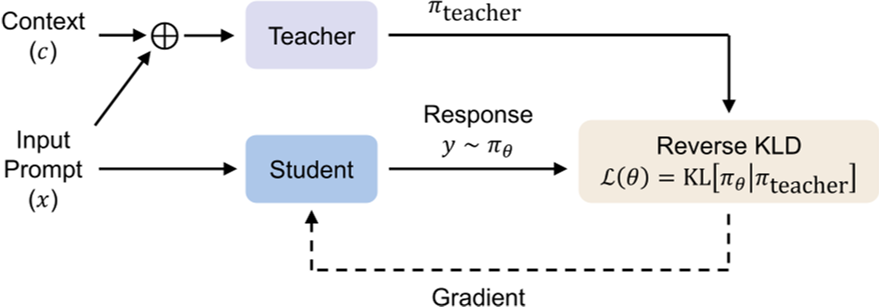
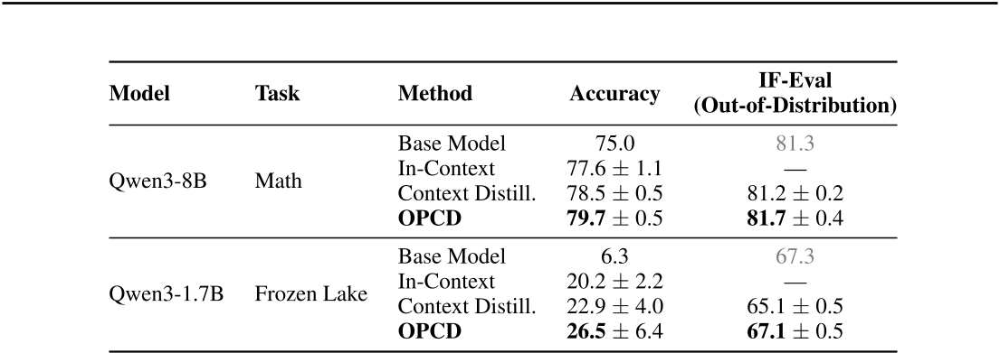
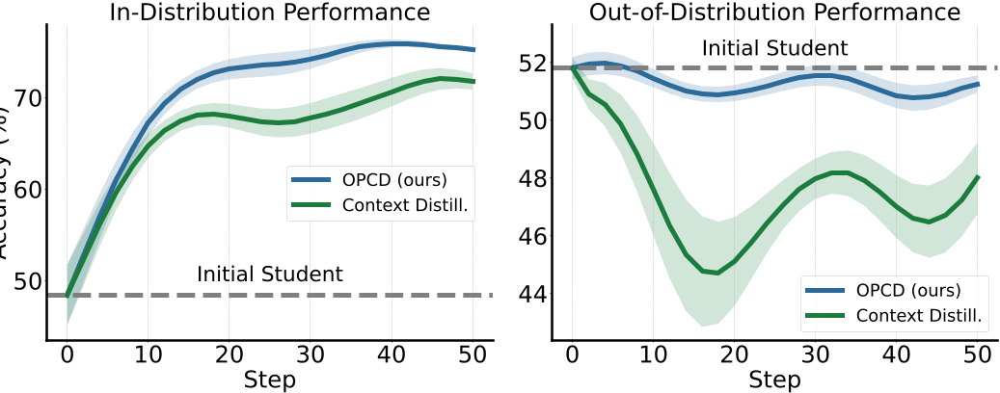
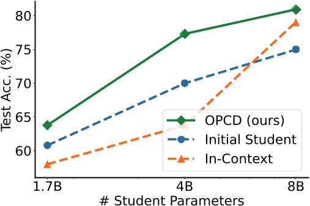

# Daily Paper Reading — On-Policy Context Distillation for Language Models

## Structured Summary

| Dimension | Content |
|---|---|
| **Title** | On-Policy Context Distillation for Language Models |
| **Institution** | Microsoft Research |
| **Authors** | Tianzhu Ye, Li Dong, Xun Wu, Shaohan Huang, Furu Wei |
| **Date** | February 12, 2026 |
| **Venue** | arXiv:2602.12275v1 |
| **Link** | https://aka.ms/GeneralAI |
| **Summary** | Existing context distillation methods rely on off-policy training with forward KL minimization, suffering from exposure bias and mode-covering. This paper proposes On-Policy Context Distillation (OPCD), which trains a student model on its own generated trajectories while minimizing reverse KL divergence against a context-conditioned teacher. OPCD consistently outperforms baselines on mathematical reasoning, text-based games, and domain-specific tasks while better preserving out-of-distribution capabilities and enabling effective cross-size distillation. |

---

## 1. Background and Problem

This work sits at the intersection of knowledge distillation and in-context learning for large language models (LLMs). While LLMs can adapt effectively through in-context prompting, this knowledge is transient: once the context window is cleared, the model must re-learn from the prompt each time. Prior context distillation methods [ABC+21, SKZ22] address this by training a student model to mimic a context-conditioned teacher, but they rely on off-policy forward KL minimization on a fixed dataset, causing exposure bias (training on teacher-generated data while generating autoregressively at inference) and mode-covering behavior that spreads probability mass to low-quality outputs. The central question is: **how can we robustly internalize transient in-context knowledge into model parameters?**

### 1.1 Core Hypothesis

The authors hypothesize that on-policy sampling — training the student on its own generation trajectories — bridges the training-inference distribution gap and, combined with reverse KL minimization, promotes mode-seeking behavior that more precisely aligns the student with the teacher's context-aware distribution.

---

## 2. Method

OPCD formalizes context internalization as follows: given input $x$ and context $c$, the student $\pi_\theta$ first generates a response $y$ **without** seeing $c$ (on-policy rollout), then minimizes the token-level reverse KL divergence between its distribution and the context-conditioned teacher $\pi_\text{teacher}(\cdot \mid c, x, y_{<t})$:

$$\mathcal{L}(\theta) = \mathbb{E}_{(x,c)\sim\mathcal{D},\, y\sim\pi_\theta(\cdot|x)}\left[\frac{1}{|y|}\sum_{t=1}^{|y|} D_\text{KL}\!\left(\pi_\theta(\cdot \mid x, y_{<t}) \,\|\, \pi_\text{teacher}(\cdot \mid c, x, y_{<t})\right)\right]$$

Reverse KL encourages **mode-seeking**: the student focuses on high-probability regions of the teacher's distribution rather than spreading mass across all teacher tokens, suppressing low-confidence outputs. In practice, the KL is approximated by summing only over the top-$k$ tokens predicted by the student, making the computation tractable. The framework supports two teacher configurations: **teacher-student distillation** ($\pi_\text{teacher} \neq \pi_\theta$, the default, with a frozen or periodically updated larger teacher) and **self-distillation** ($\pi_\text{teacher} = \pi_\theta$, the teacher and student share weights). OPCD is applied to two applications: (1) **experiential knowledge distillation**, where the model extracts high-level, transferable insights from historical solution traces and internalizes them across three stages (extraction → accumulation → consolidation via OPCD); and (2) **system prompt distillation**, where beneficial behaviors encoded in optimized system prompts are baked into model weights, eliminating inference-time prompt overhead.

---

## 3. Experiments

### 3.1 Experimental Setup

| Dimension | Name | Quantity |
|---|---|---|
| **Models** | Qwen3-8B, Qwen3-4B, Qwen3-1.7B, Qwen3-4B-Instruct-2507, Qwen2.5-7B-Instruct, Qwen2.5-3B-Instruct, Llama-3.1-8B-Instruct, Llama-3.2-3B-Instruct | 8 |
| **Training** | DAPO-Math-17K (~14K math problems), TextArena Frozen Lake & Sokoban (text games), MedMCQA + safety datasets (system prompt) | Math ~14K; text games: multi-turn rollouts; system prompt: full training splits |
| **Evaluation** | Math test set (1000 samples), text-game test set (128 samples), MedMCQA (500 samples), safety classification (500 samples), IF-Eval (OOD) | Per-task splits |
| **Metrics** | Task Accuracy, IF-Eval strict accuracy (OOD) | 2 |

### 3.2 Experimental Analysis

#### 3.2.1 Experiential Knowledge Consolidation

- **Table Content**: Table 1 reports task accuracy and OOD IF-Eval scores for Base Model, In-Context, Context Distillation, and OPCD across Qwen3-8B (math) and Qwen3-1.7B (Frozen Lake) under the test-time experiential knowledge setting, where experiential knowledge is sampled from an accumulated pool without quality filtering.
- **Revealed Insights**: OPCD surpasses off-policy context distillation on both in-distribution accuracy and OOD generalization, demonstrating that on-policy training successfully internalizes context while mitigating catastrophic forgetting.
- **Key Data**: Qwen3-8B Math: Base 75.0 → Context Distill. 78.5 → OPCD **79.7** (accuracy); IF-Eval: 81.3 → 81.2 → **81.7**. Qwen3-1.7B Frozen Lake: Base 6.3 → Context Distill. 22.9 → OPCD **26.5**.

#### 3.2.2 System Prompt Distillation: In-Distribution vs. OOD Trade-off

- **Figure Content**: Figure 3 tracks in-distribution (safety task, left) and out-of-distribution (medical task, right) accuracy across training steps when distilling from a safety system prompt using Qwen2.5-3B-Instruct student and Qwen2.5-7B-Instruct teacher.
- **Revealed Insights**: OPCD achieves both higher in-distribution accuracy and substantially better OOD retention than off-policy context distillation — surpassing the off-policy baseline by approximately 4 points on OOD accuracy — consistent with the finding that on-policy training mitigates forgetting on OOD tasks [SPA25, CRNC25].

#### 3.2.3 Cross-Size Distillation

- **Figure Content**: Figure 2 plots test accuracy for student models of sizes 1.7B, 4B, and 8B when trained with OPCD using experiential knowledge from a frozen Qwen3-8B teacher, compared against Initial Student and In-Context baselines.
- **Revealed Insights**: OPCD consistently improves performance at all student scales, whereas directly injecting the teacher's experiential knowledge into a smaller model's context degrades performance — demonstrating that on-policy alignment between the experiential knowledge and the consuming model is critical for effective cross-size transfer.

---

## 4. Limitations and Future Work

### 4.1 Original Description

The authors state: "Our work opens avenues for future research on continual accumulation of experiential knowledge, adaptive context selection strategies, and scaling OPCD to broader domains requiring persistent knowledge internalization."

### 4.2 Model Summary

OPCD currently requires white-box access to the teacher's token-level probability distributions, making it inapplicable to black-box API teachers without approximations. While reverse KL mitigates mode-covering, it can induce mode collapse when the teacher distribution is highly multimodal and the student has limited capacity. The quality of extracted experiential knowledge remains a critical bottleneck — raw traces degrade performance (70.5% vs. 77.4% for structured knowledge), yet automated quality assessment at scale is non-trivial. Future directions include: continual online OPCD where the experience pool is updated dynamically as the model encounters new problems; combining OPCD with verifiable-reward RL (RLVR) to jointly optimize task performance and context internalization; and extending OPCD to retrieval-augmented or multi-agent settings where knowledge is distributed across multiple sources and agents. (Generated by Claude Sonnet 4.6)
