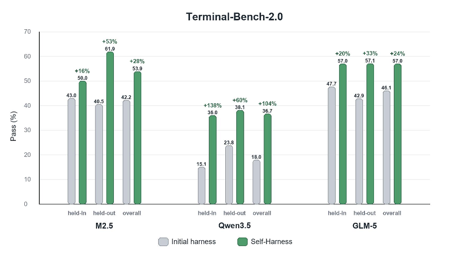

# Daily Paper Reading — Self-Harness: Harnesses That Improve Themselves

## Structured Summary

| Dimension | Content |
|---|---|
| **Title** | Self-Harness: Harnesses That Improve Themselves |
| **Institution** | Shanghai Artificial Intelligence Laboratory |
| **Authors** | Hangfan Zhang, Shao Zhang, Kangcong Li, Chen Zhang, Yang Chen, Yiqun Zhang, Lei Bai, Shuyue Hu |
| **Date** | 2026-06-08 (arXiv v1) |
| **Venue** | arXiv preprint |
| **Link** | Not provided |
| **Summary** | This work addresses the poor scalability of human-engineered agent harnesses, which are inherently model-specific yet must be redesigned for each rapidly evolving LLM. The core method, Self-Harness, lets a fixed base model improve its own operating harness through an iterative three-stage loop — Weakness Mining, Harness Proposal, and Proposal Validation — without human engineers or stronger external agents. On Terminal-Bench-2.0, held-out pass rates improve from 40.5% to 61.9% (MiniMax M2.5), 23.8% to 38.1% (Qwen3.5-35B-A3B), and 42.9% to 57.1% (GLM-5), showing that models can turn their own failure patterns into concrete, executable harness changes that generalize to unseen tasks. |

---

## 1. Background and Problem

This research belongs to the field of LLM-based agent systems, focusing on the design of the harness — the surrounding layer of system prompts, tools, runtime mechanisms, verification rules, and failure-recovery procedures that mediates between a model and its environment. Harnesses are still largely engineered by human experts, yet "different models can exhibit distinct behavioral patterns, tool-use habits, error modes, and sensitivities to prompting; consequently, a harness that works well for one model may be suboptimal for another" (§1), making manual per-model harness tuning increasingly costly as new models are released at a rapid pace. The core problem this paper tackles is whether a fixed model can improve the very harness through which it operates, without relying on human engineers or stronger external agents.

### 1.1 Core Hypothesis

The research objective is to test "whether the same fixed model, operating under the current harness, can propose a bounded candidate change to the harness that governs its own future behavior" (§2). The core hypothesis is that targeted harness edits grounded in verifier-backed behavioral evidence from execution traces, when gated by regression testing, will generalize to unseen tasks rather than merely overfitting observed evaluation failures.

---

## 2. Method

Self-Harness is formalized as an iterative improvement loop (Algorithm 1) in which the model M and evaluator E are held fixed and only the harness h is the object of optimization, producing a lineage of harnesses h₀, h₁, …. Each round has three stages. **Weakness Mining**: the current harness is run on a held-in split to collect execution traces; each failed record is assigned a failure signature φ(rᵢ) = (cᵢ, qᵢ, mᵢ) — the terminal verifier-level cause, the causal status of the relevant agent behavior, and the abstract agent mechanism exposed by the trace — and failures are clustered deterministically by exact signature agreement into a structured evidence bundle; this attribution step prevents conflating superficial symptoms (e.g., timeouts, missing artifacts) with reusable failure mechanisms. **Harness Proposal**: the same fixed model, invoked under the current harness in a proposer role, generates K mutually distinct candidate edits {(Δⱼ, aⱼ)} in parallel from the evidence bundle, where each edit must be grounded in a primary failure mechanism and mapped to a declared editable surface; "diversity is encouraged across proposal branches, while minimality is enforced within each branch" (§3.3), forbidding broad rewrites of the control architecture. **Proposal Validation**: each candidate harness is re-evaluated on both the held-in and held-out splits and accepted only under the conservative rule Δin ≥ 0, Δho ≥ 0, and max(Δin, Δho) > 0 — improving at least one split without degrading the other — with compatible accepted candidates merged into the next harness version. The underlying rationale is to treat harness improvement as "an empirical state transition" (§5): every edit specifies the behavior it targets, the surface it modifies, the motivating evidence, and the evaluation result justifying promotion, keeping the entire lineage auditable.

---

## 3. Experiments

### 3.1 Experimental Setup

| Dimension | Name | Quantity |
|---|---|---|
| **Models** | MiniMax M2.5, Qwen3.5-35B-A3B, GLM-5 | 3 |
| **Training** | No training (model weights fixed; the held-in split only supplies execution evidence) | Not applicable |
| **Evaluation** | Terminal-Bench-2.0 (89 containerized terminal tasks; a fixed 64-case subset partitioned into held-in and held-out splits) | 64 |
| **Metrics** | Pass (%) — percentage of task attempts passing the benchmark verifier, computed over two repeated attempts per harness candidate | 1 |

The initial harness builds on the DeepAgent SDK and is intentionally minimal: a short benchmark-facing system prompt plus the default filesystem and shell tools (Figure 3). Self-Harness may only modify declared editable surfaces in the harness definition file that configures how DeepAgent is instantiated. MiniMax M2.5 and GLM-5 were accessed via hosted APIs, while Qwen3.5-35B-A3B was deployed locally on four NVIDIA H200 GPUs with SGLang.

### 3.2 Experimental Analysis

### 3.2.1 Main Results on Terminal-Bench-2.0 (Figure 4)

- **Figure Content**: For each model backend, bars compare Pass (%) of the initial harness versus the final Self-Harness-promoted harness on the held-in split, held-out split, and overall set, with relative gains annotated above the bars.
- **Revealed Insights**: All three backends improve or preserve performance on both splits, and "no promoted harness degrades either split" (§4.2), indicating the gains target reusable execution mechanisms rather than overfitting held-in failures.
- **Key Data**: Held-in Pass rises from 43.0% to 50.0% for MiniMax M2.5 (+16% relative), 15.1% to 36.0% for Qwen3.5 (+138%), and 47.7% to 57.0% for GLM-5 (+20%); held-out Pass rises from 40.5% to 61.9% (+53%), 23.8% to 38.1% (+60%), and 42.9% to 57.1% (+33%), respectively.

### 3.2.2 Evolution Trajectories and Retained Edits (Figures 5, 6, 10)

- **Figure Content**: Each evolution plot shows Pass (%) over Self-Harness iterations, with green markers for accepted candidates and gray crosses for rejected ones, paired with code diffs of the edits retained in the final harness.
- **Revealed Insights**: Self-Harness reaches the final harness through a small number of validation-gated edits rather than a smooth sequence of uniformly successful proposals; all three models share an artifact-reliability theme, but the concrete edits are model-specific — M2.5 emphasizes early output creation and a cap on total tool messages, Qwen3.5 adds dependency prechecking, loop breaking, and tool-error-triggered middleware, and GLM-5 focuses on persisting environment changes across shell sessions and shifting from exploration to implementation.
- **Key Data**: Over their evolution runs, M2.5 improves from 42.2% to 53.9% (3 retained edits), Qwen3.5 from 20.3% to 36.7% (4 retained edits; subagent and skill branches were abandoned for lack of further improvement), and GLM-5 from 46.1% to 57.0%.

### 3.2.3 Trace-Level Case Studies (Figures 7, 8)

- **Figure Content**: Each figure contrasts a failed trace under the initial harness (left) with a successful trace under the edited harness (right) on a Terminal-Bench-2.0 task.
- **Revealed Insights**: The accepted edits change observable execution behavior in ways aligned with the diagnosed failure mechanisms — M2.5 shifts from open-ended exploration to a concrete create-early-and-verify workflow, and Qwen3.5 recovers missing artifacts after tool errors instead of repeating failed actions — suggesting "Self-Harness improves performance by inducing targeted workflow changes rather than by relying on unrelated stochastic variation or a uniformly stronger prompt" (§4.3).

---

## 4. Limitations and Future Work

### 4.1 Original Description

From §5: "Self-Harness also has important limits. It studies bounded harness edits under fixed benchmarks, not open-ended self-improvement. Accepted edits may still reflect benchmark-specific failure patterns, and the protocol depends on the quality of verifier outcomes and trace records. Higher-stakes harness changes would require stronger acceptance gates than pass-rate non-regression alone." For future work, the authors state that "future work can further explore application of self-harness-style self-improvement in broader environments, but the core requirement remains the same: self-improvement should be grounded in behavioral evidence rather than only in the proposer's rationale for a plausible edit."

### 4.2 Model Summary

Beyond the stated limitations, several points deserve attention: the evaluation covers a single benchmark (a 64-case subset of Terminal-Bench-2.0) and a single agent framework (DeepAgent), and each candidate is evaluated over only two repeats, so accept/reject decisions may be noisy given the high task-level variance typical of agentic benchmarks; the conservative two-split non-regression rule may also reject edits with positive net benefit, limiting search efficiency; and each round requires re-evaluating K candidates over the full task set, an overhead that scales linearly with task-set size. Promising future directions include replacing the held-out gate with statistical significance tests or multi-benchmark cross-validation for stronger generalization guarantees, studying whether accepted harness edits transfer across model versions, and combining Self-Harness with parameter-level self-improvement to co-evolve weights and harness in a single agent system. (Generated by Claude Fable 5)
