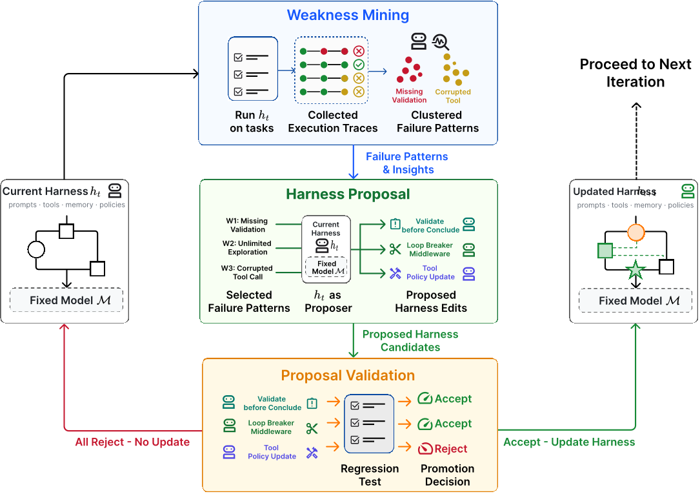
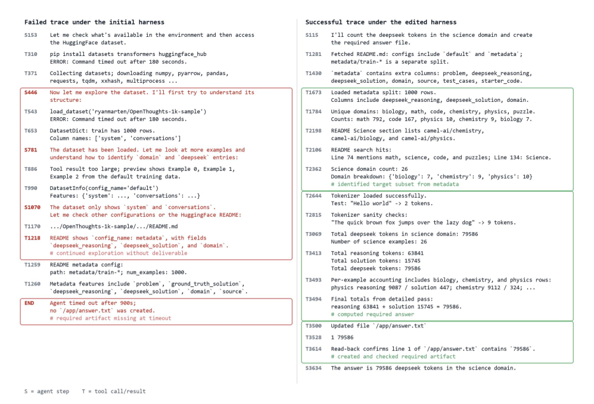
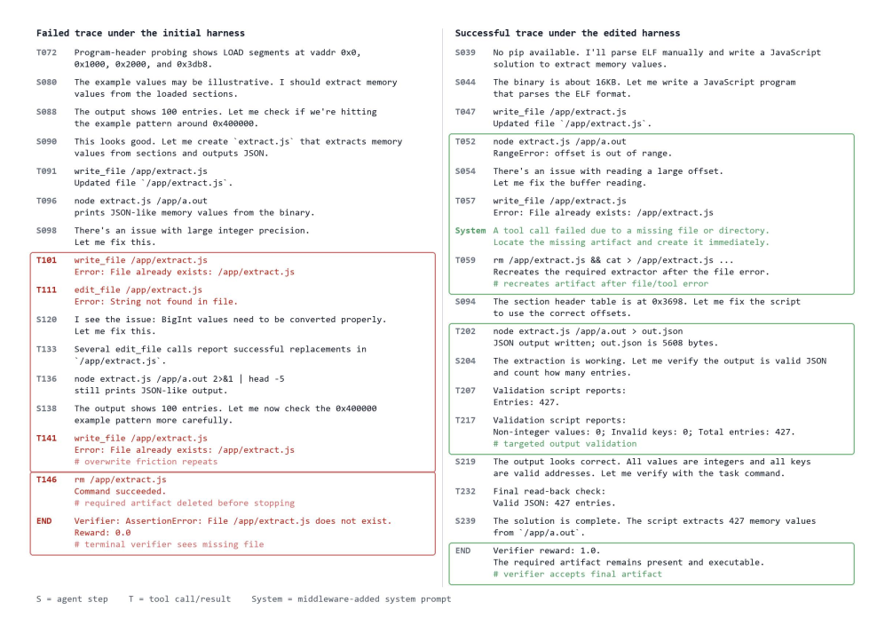

# 每日论文报告 — Self-Harness: Harnesses That Improve Themselves

## 结构化摘要

| 维度 | 内容 |
|---|---|
| **标题** | Self-Harness: Harnesses That Improve Themselves |
| **机构** | 上海人工智能实验室（Shanghai Artificial Intelligence Laboratory） |
| **作者** | Hangfan Zhang, Shao Zhang, Kangcong Li, Chen Zhang, Yang Chen, Yiqun Zhang, Lei Bai, Shuyue Hu |
| **时间** | 2026-06-08（arXiv v1） |
| **发表** | arXiv 预印本（Preprint） |
| **链接** | 未提供 |
| **总结** | 该研究旨在解决智能体框架（harness）依赖人类专家手工设计、难以随模型多样化而扩展的问题。其核心方法是 Self-Harness：让固定的基座模型通过"弱点挖掘（Weakness Mining）—框架提议（Harness Proposal）—提议验证（Proposal Validation）"三阶段迭代闭环，自主改进自身运行的 harness。在 Terminal-Bench-2.0 上，三个不同家族的模型经 Self-Harness 优化后，held-out 通过率分别从 40.5% 提升至 61.9%（MiniMax M2.5）、23.8% 提升至 38.1%（Qwen3.5-35B-A3B）、42.9% 提升至 57.1%（GLM-5），证明模型可以将自身特有的失败模式转化为具体可执行的 harness 修改。 |

---

## 1. 研究背景和问题

本研究属于 LLM 智能体系统（LLM-based agents）领域，关注模型与环境之间的中介层——框架（harness，包括系统提示词、工具、运行时机制、验证规则与失败恢复流程等）的设计问题。当前 harness 主要由人类专家手工设计，但"不同模型表现出不同的行为模式、工具使用习惯、错误模式和提示敏感性，对一个模型有效的 harness 对另一个模型可能是次优的"（原文 §1），随着新模型快速涌现，人工逐一定制 harness 的范式难以扩展。本文要解决的核心问题是：能否让一个固定的模型在不依赖人类工程师或更强外部智能体的情况下，自主改进自身运行的 harness。

### 1.1 核心假设

本文的研究目标是验证"同一个固定模型，在当前 harness 下运行时，能否对支配其自身未来行为的 harness 提出有界的（bounded）候选修改"（原文 §2）。其核心假设是：基于执行轨迹中可验证的行为证据（behavioral evidence）所提出的针对性 harness 修改，在回归测试门控下能够泛化到未见任务，而非仅仅过拟合已观察到的评测失败。

---

## 2. 方法

Self-Harness 被形式化为一个迭代改进循环（Algorithm 1）：固定模型 M 和评估器 E 不变，仅 harness h 作为优化对象，形成 harness 谱系 h₀, h₁, …。每轮循环包含三个阶段。**弱点挖掘（Weakness Mining）**：在 held-in 任务集上运行当前 harness 收集执行轨迹，对失败记录提取失败签名 φ(rᵢ)=(cᵢ, qᵢ, mᵢ)——即验证器层面的终端失败原因、相关智能体行为的因果状态、以及轨迹暴露的抽象行为机制——并按签名精确一致进行确定性聚类，输出结构化证据包（evidence bundle）；这一归因设计避免将表面症状（如超时、缺失产物）与可复用的失败机制混淆。**框架提议（Harness Proposal）**：以同一模型在当前 harness 下扮演提议者角色，基于证据包并行生成 K 个互不相同的候选修改 {(Δⱼ, aⱼ)}，每个修改必须锚定一个具体失败机制并映射到声明的可编辑接口，"跨分支鼓励多样性，分支内强制最小性"（原文 §3.3），不允许大规模重写控制架构。**提议验证（Proposal Validation）**：每个候选 harness 在 held-in 与 held-out 两个划分上重新评测，仅当满足保守接受规则 Δin ≥ 0 且 Δho ≥ 0 且 max(Δin, Δho) > 0（即至少一个划分提升且另一个不退化）时才被接受，多个兼容的通过候选会被合并为下一版 harness。该设计的核心理由是将 harness 改进视为"经验性的状态转移"（原文 §5）：每次修改都有明确的目标行为、修改面、动机证据与晋升依据，全程可审计。

---

## 3. 实验

### 3.1 实验设置

| 维度 | 名称 | 数量 |
|---|---|---|
| **模型** | MiniMax M2.5、Qwen3.5-35B-A3B、GLM-5 | 3 |
| **训练** | 无训练（模型权重固定；held-in 划分仅提供执行证据） | 不适用 |
| **评测** | Terminal-Bench-2.0（89 个容器化终端任务，取固定 64 例子集，划分为 held-in 与 held-out） | 64 |
| **指标** | Pass(%)（通过基准验证器的任务尝试百分比，默认每个 harness 候选重复评测 2 次） | 1 |

初始 harness 基于 DeepAgent SDK 刻意保持最小化：仅含简短的基准向系统提示词与默认文件系统/Shell 工具（图 3）。Self-Harness 只能修改配置 DeepAgent 实例化方式的 harness 定义文件中声明的可编辑接口。MiniMax M2.5 与 GLM-5 通过托管 API 访问，Qwen3.5-35B-A3B 在 4 张 NVIDIA H200 上以 SGLang 本地部署。

### 3.2 实验解析

### 3.2.1 主实验：Terminal-Bench-2.0 前后对比（Figure 4）

- **图表内容**：该图按模型分组展示初始 harness 与 Self-Harness 产出的最终 harness 在 held-in 划分、held-out 划分及总体任务集上的 Pass(%)，柱上注释为相对增益。
- **揭示关系**：三个模型后端在两个划分上均提升或保持，"没有任何被晋升的 harness 使任一划分退化"（原文 §4.2），说明改进并非过拟合 held-in 失败案例，而是命中了可复用的执行机制。
- **关键数据**：held-in 上 MiniMax M2.5 从 43.0% 升至 50.0%（相对 +16%）、Qwen3.5 从 15.1% 升至 36.0%（相对 +138%）、GLM-5 从 47.7% 升至 57.0%（相对 +20%）；held-out 上三者分别从 40.5%→61.9%（+53%）、23.8%→38.1%（+60%）、42.9%→57.1%（+33%）。

### 3.2.2 演化轨迹与保留修改（Figures 5、6、10）

- **图表内容**：各模型的演化曲线图横轴为迭代轮次、纵轴为 Pass(%)，绿色标记为被接受的候选、灰色叉为被拒绝的候选；配套代码 diff 展示最终 harness 保留的修改。
- **揭示关系**：Self-Harness 通过少数几个经验证门控的修改（而非平滑连续的成功提议）到达最终 harness；三个模型共享"产物可靠性"主题，但具体修改高度模型特异——M2.5 侧重尽早创建输出文件与限制工具消息总数，Qwen3.5 引入依赖预检、循环打断与工具错误触发的中间件，GLM-5 则强调环境变更跨 Shell 会话持久化与从探索转向实现。
- **关键数据**：整体演化中 M2.5 从 42.2% 升至 53.9%（保留 3 项修改），Qwen3.5 从 20.3% 升至 36.7%（保留 4 项修改，子代理与技能分支因无进一步提升被弃用），GLM-5 从 46.1% 升至 57.0%。

### 3.2.3 轨迹级案例分析（Figures 7、8）

- **图表内容**：两图各展示一个 Terminal-Bench-2.0 任务在初始 harness（左，失败）与修改后 harness（右，成功）下的执行轨迹对比。
- **揭示关系**：被接受的修改以与诊断出的失败机制一致的方式改变了可观测的执行行为——M2.5 从无限探索转向"尽早创建产物并回读验证"的具体工作流，Qwen3.5 在工具错误后被重定向去恢复缺失产物而非反复重试同一失败操作——"说明 Self-Harness 的提升来自针对性的工作流改变，而非无关的随机波动或一条普适的更强提示词"（原文 §4.3）。

---

## 4. 局限性与未来工作

### 4.1 原文描述

原文 §5 指出：「Self-Harness 也有重要的局限。它研究的是固定基准下的有界 harness 修改，而非开放式自我改进（open-ended self-improvement）。被接受的修改可能仍反映基准特有的失败模式，且整个协议依赖于验证器结果与轨迹记录的质量。更高风险的 harness 变更需要比通过率不退化更强的接受门控。」未来工作方面，原文提出"可以进一步探索 self-harness 式自我改进在更广泛环境中的应用，但核心要求不变：自我改进应当基于行为证据，而不能仅凭提议者对某个看似合理修改的论证"。

### 4.2 模型总结

除原文已述局限外，本工作还有几点值得注意：实验仅在单一基准（Terminal-Bench-2.0 的 64 例子集）和单一智能体框架（DeepAgent）上验证，每个候选仅重复评测 2 次，在任务级方差较大的智能体评测中接受/拒绝判定可能存在噪声；保守的"双划分不退化"接受规则也可能拒绝净收益为正的修改，限制了搜索效率；此外每轮需对 K 个候选在全部任务上重复评测，计算开销随任务集规模线性增长，扩展到更大任务分布时成本可观。未来方向包括：将 held-out 门控替换为统计显著性检验或多基准交叉验证以增强泛化保障、研究 harness 修改在模型版本升级间的可迁移性、以及将 Self-Harness 与参数层面的自我改进（如基于内在反馈的训练）结合，形成"权重—框架"协同演化的智能体系统。（由 Claude Fable 5 模型生成）
